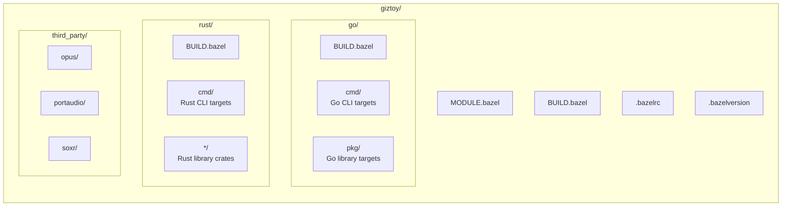

# Bazel Build

Giztoy uses [Bazel](https://bazel.build) as its unified build system across all languages and platforms.

## Why Bazel?

1. **Multi-language Support**: Build Go, Rust, C/C++ with a single tool
2. **Hermetic Builds**: Reproducible builds across different machines
3. **Cross-platform**: Target multiple platforms from a single codebase
4. **Incremental**: Only rebuild what changed

## Quick Start

### Prerequisites

- [Bazelisk](https://github.com/bazelbuild/bazelisk) (recommended) or Bazel 7.x+
- Go 1.24+ (for native Go builds)
- Rust 1.80+ (for native Rust builds)

### Build Commands

```bash
# Build everything
bazel build //...

# Build specific targets
bazel build //go/cmd/giztoy      # Go CLI
bazel build //rust/cmd/minimax    # Rust CLI

# Run tests
bazel test //...

# Run a binary
bazel run //go/cmd/giztoy -- --help
```

## Project Structure



## Rules Used

| Language | Rules |
|----------|-------|
| Go | [rules_go](https://github.com/bazelbuild/rules_go) + Gazelle |
| Rust | [rules_rust](https://github.com/bazelbuild/rules_rust) + crate_universe |
| C/C++ | Built-in `cc_library`, `cc_binary` |
| Shell | [rules_shell](https://github.com/bazelbuild/rules_shell) |

## Dependency Management

### Go Dependencies

Go dependencies are managed via `go/go.mod` and synced with Gazelle:

```bash
# Update Go dependencies
cd go && go mod tidy

# Regenerate BUILD files
bazel run //:gazelle
```

### Rust Dependencies

Rust dependencies are managed via `rust/Cargo.toml` and synced with crate_universe:

```bash
# Update Cargo.lock
cd rust && cargo update

# Bazel will automatically fetch crates on next build
```

### C/C++ Dependencies

Third-party C libraries are configured in `third_party/` with custom BUILD files.

## Cross-Platform Builds

### Supported Platforms

| Platform | Status |
|----------|--------|
| Linux (x86_64, arm64) | ✅ |
| macOS (x86_64, arm64) | ✅ |
| Android | ✅ |
| iOS | ✅ |
| HarmonyOS | ✅ |
| ESP32 | 🚧 |

### Platform-specific Builds

```bash
# Android
bazel build --config=android //...

# iOS
bazel build --config=ios //...
```

## Common Tasks

### Adding a New Go Package

1. Create the package in `go/pkg/mypackage/`
2. Run Gazelle to generate BUILD file:
   ```bash
   bazel run //:gazelle
   ```

### Adding a New Rust Crate

1. Create the crate in `rust/mypackage/`
2. Add to `rust/Cargo.toml` workspace members
3. Create `BUILD.bazel` with `rust_library` rule

### Adding a C/C++ Dependency

1. Create config in `third_party/libname/`
2. Add `BUILD.bazel` with `cc_library` rule
3. Reference from dependent targets

## Common Targets

This section introduces commonly used Bazel targets for daily development.

### Documentation

```bash
# Preview documentation locally (default port 8000)
bazel run //pages:serve-local

# Specify port
bazel run //pages:serve-local -- 3000

# Build static documentation files (outputs www.tar.gz)
bazel build //pages:www

# Deploy to GitHub Pages
bazel run //pages:deploy
```

### CLI Tools

#### Go CLI

```bash
# MiniMax CLI
bazel run //go/cmd/giztoy -- --help
bazel run //go/cmd/giztoy -- minimax text chat "Hello"
bazel run //go/cmd/giztoy -- minimax speech tts -t "Test speech"

# Doubao Speech CLI
bazel run //go/cmd/giztoy -- doubao --help
bazel run //go/cmd/giztoy -- doubao tts -t "Test speech"

# DashScope CLI
bazel run //go/cmd/giztoy -- dashscope --help

# GearTest (device simulation testing tool)
bazel run //go/cmd/giztoy -- gear --help
bazel run //go/cmd/giztoy -- gear run --config config.yaml
```

#### Rust CLI

```bash
# MiniMax CLI (Rust)
bazel run //rust/cmd/minimax -- --help
bazel run //rust/cmd/minimax -- text chat "Hello"

# Doubao Speech CLI (Rust)
bazel run //rust/cmd/doubaospeech -- --help

# DashScope CLI (Rust)
bazel run //rust/cmd/dashscope -- --help
```

### Example Test Scripts

Example test scripts are located in `e2e/cmd/` for batch testing API features:

```bash
# MiniMax example tests
bazel run //e2e/cmd/minimax:run -- go all      # Run all Go tests
bazel run //e2e/cmd/minimax:run -- rust 1      # Run Rust level 1 tests
bazel run //e2e/cmd/minimax:run -- both quick  # Test both Go and Rust

# Doubao Speech example tests
bazel run //e2e/cmd/doubaospeech:run -- tts
bazel run //e2e/cmd/doubaospeech:run -- asr-stream

# DashScope example tests
bazel run //e2e/cmd/dashscope:run -- omni-chat
```

### Go Examples

```bash
# Audio processing examples
bazel run //examples/go/audio/songs
bazel run //examples/go/audio/pcm/resampler
bazel run //examples/go/audio/pcm/mixer

# MiniMax examples
bazel run //examples/go/minimax/text_chat
bazel run //examples/go/minimax/speech_tts
bazel run //examples/go/minimax/video_t2v

# Doubao Speech examples
bazel run //examples/go/doubaospeech/tts_ws
bazel run //examples/go/doubaospeech/asr_sauc

# GenX examples
bazel run //examples/go/genx/chat

# Speech unified interface examples
bazel run //examples/go/speech/tts_asr
```

### Rust Examples

```bash
# MiniMax examples
bazel run //examples/rust/minimax:speech
bazel run //examples/rust/minimax:text_stream

# Doubao Speech examples
bazel run //examples/rust/doubaospeech:tts_ws

# GenX examples
bazel run //examples/rust/genx:chat
```

### Development Helpers

```bash
# Regenerate Go BUILD files
bazel run //:gazelle

# Update Go dependency repositories
bazel run //:gazelle -- update-repos -from_file=go/go.mod
```

## Troubleshooting

### Clean Build

```bash
bazel clean --expunge
bazel build //...
```

### Dependency Issues

```bash
# Refresh Go deps
bazel run //:gazelle -- update-repos -from_file=go/go.mod

# Refresh Rust deps
bazel clean --expunge  # crate_universe re-fetches on next build
```

## Related

- [Examples Documentation](../examples/doc.md)
- [GitHub Actions CI](../../.github/workflows/)
