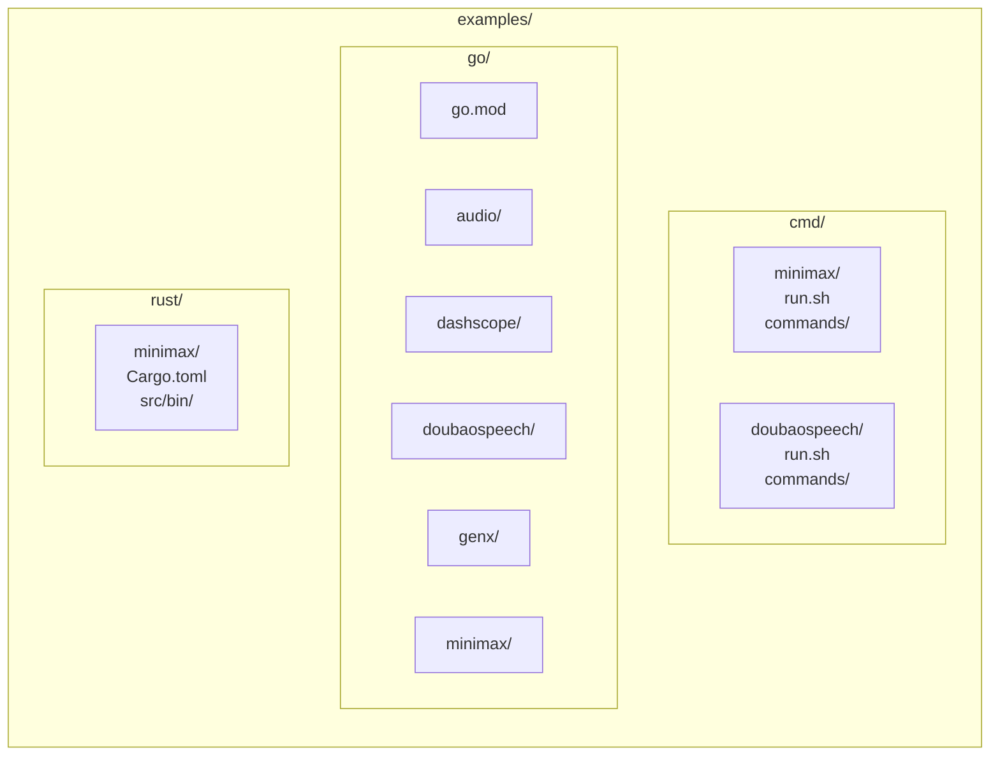

# Examples

## Overview
This document describes the `examples/` directory layout and how to run the
included example programs and CLI scripts. Examples are grouped by language
and by SDK.

## Directory Layout

## How to Run

### CLI Script Examples
- Minimax CLI test runner:
  - `./e2e/cmd/minimax/run.sh go 1`
  - Bazel: `bazel run //e2e/cmd/minimax:run -- go 1`
- Doubao Speech CLI test runner:
  - `./e2e/cmd/doubaospeech/run.sh tts`
  - Bazel: `bazel run //e2e/cmd/doubaospeech:run -- tts`

### Go Examples
All Go examples share one module at `examples/go/go.mod` and depend on the
local `go/` module via `replace`.

- Build all Go examples:
  - `cd examples/go && go build ./...`

### Rust Examples
Rust examples are independent crates.

- Build the MiniMax Rust examples:
  - `cd examples/rust/minimax && cargo build --release`

## Notes
- Example binaries often depend on environment variables for API keys.
- Refer to the SDK docs under `docs/lib/{sdk}/` for configuration details.
