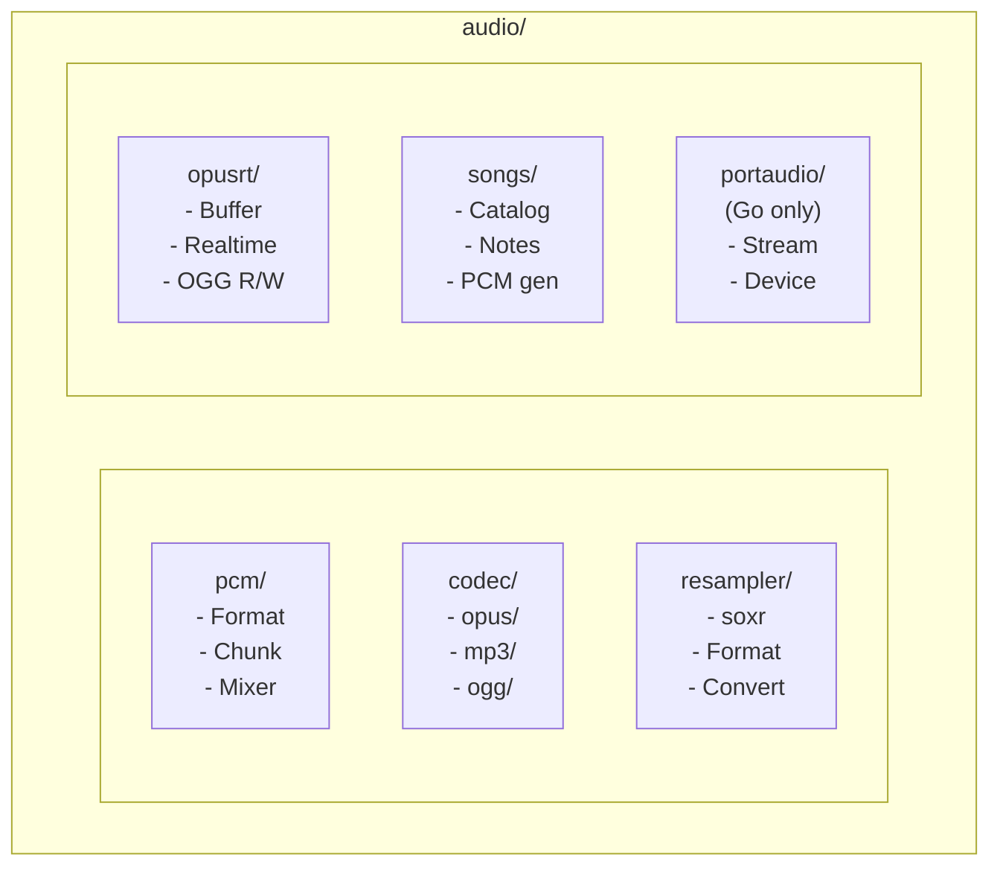
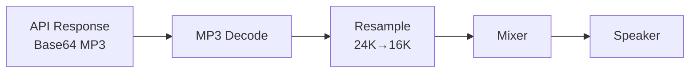
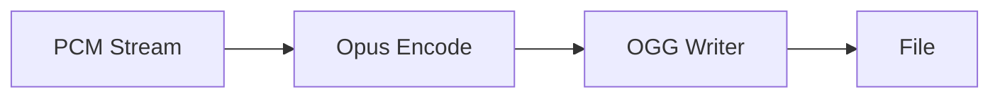

# Audio Package

Audio processing framework for speech and multimedia applications.

## Design Goals

1. **Real-time Processing**: Low-latency audio mixing, encoding, and streaming
2. **Format Flexibility**: Support common audio formats (PCM, Opus, MP3, OGG)
3. **Cross-platform**: FFI bindings to native libraries (libopus, libsoxr, lame)
4. **Streaming-first**: Designed for continuous audio streams, not just files

## Architecture

## Submodules

| Module | Description | Go | Rust |
|--------|-------------|:--:|:----:|
| [pcm/](./pcm/doc.md) | PCM format, chunks, mixing | ✅ | ✅ |
| [codec/](./codec/doc.md) | Audio codecs (Opus, MP3, OGG) | ✅ | ✅ |
| [resampler/](./resampler/doc.md) | Sample rate conversion (soxr) | ✅ | ✅ |
| [opusrt/](./opusrt/doc.md) | Realtime Opus streaming | ✅ | ⚠️ |
| [songs/](./songs/doc.md) | Built-in melodies | ✅ | ✅ |
| [portaudio/](./portaudio/doc.md) | Audio I/O devices | ✅ | ❌ |

## Audio Formats

### PCM Formats (Predefined)

| Format | Sample Rate | Channels | Bit Depth |
|--------|-------------|----------|-----------|
| `L16Mono16K` | 16000 Hz | 1 | 16-bit |
| `L16Mono24K` | 24000 Hz | 1 | 16-bit |
| `L16Mono48K` | 48000 Hz | 1 | 16-bit |

### Codec Support

| Codec | Encode | Decode | Container |
|-------|--------|--------|-----------|
| Opus | ✅ | ✅ | Raw, OGG |
| MP3 | ✅ | ✅ | Raw |
| OGG | N/A | N/A | Container only |

## Common Workflows

### Voice Chat (Low Latency)

### Speech Synthesis Playback

### Audio Recording

## Native Dependencies

| Library | Purpose | Build System |
|---------|---------|--------------|
| libopus | Opus codec | pkg-config / Bazel |
| libsoxr | Resampling | pkg-config / Bazel |
| lame | MP3 encoding | Bazel (bundled) |
| minimp3 | MP3 decoding | Bazel (bundled) |
| libogg | OGG container | pkg-config / Bazel |
| portaudio | Audio I/O | pkg-config / Bazel |

## Examples Directory

- `examples/go/audio/` - Go audio examples
- `examples/rust/audio/` - Rust audio examples

## Related Packages

- `buffer` - Used for audio data buffering
- `speech` - High-level speech synthesis/recognition
- `minimax`, `doubaospeech` - TTS/ASR APIs returning audio
