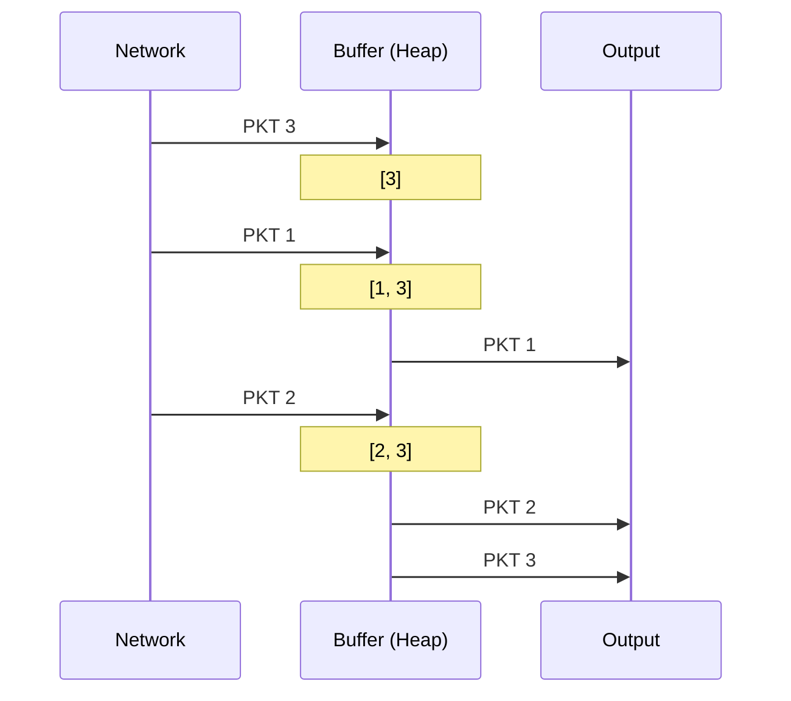
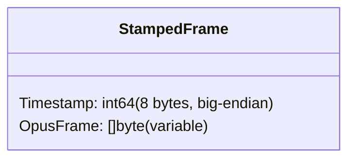
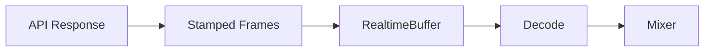
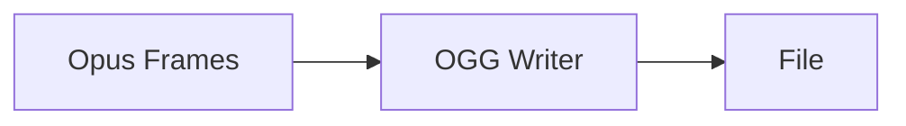

# Audio OpusRT Module

Real-time Opus stream processing with jitter buffering and packet loss handling.

## Design Goals

1. **Out-of-Order Handling**: Reorder packets that arrive out of sequence
2. **Packet Loss Detection**: Detect and report gaps for PLC (Packet Loss Concealment)
3. **Real-time Simulation**: Playback timing based on timestamps, not arrival time
4. **OGG Container Support**: Read/write Opus in OGG format (Go only)

## Core Concepts

### Jitter Buffer

Network packets may arrive out of order or with variable delay (jitter).
The jitter buffer collects packets and outputs them in correct order:



### Packet Loss Detection

Gaps between consecutive frame timestamps indicate lost packets:

```
Frame 1: 0ms - 20ms
Frame 2: 20ms - 40ms    ✓ No gap
Frame 4: 60ms - 80ms    ✗ 20ms gap (Frame 3 lost)
```

When loss is detected, the caller should use decoder PLC:

```go
frame, loss, _ := buffer.Frame()
if loss > 0 {
    // Generate PLC audio for 'loss' duration
    plcAudio := decoder.DecodePLC(...)
}
```

### Timestamped Frames

Frames are timestamped with epoch milliseconds:



## Components

### Buffer

Simple jitter buffer with min-heap ordering:
- Append frames in any order
- Read frames in timestamp order
- Max duration limit (oldest dropped)

### RealtimeBuffer

Wraps Buffer for real-time playback simulation:
- Background goroutine pulls frames at correct time
- Generates loss events when data not available
- Handles clock synchronization

### OGG Reader/Writer (Go only)

Read/write Opus streams in OGG container format:
- `OggReader`: Read Opus frames from OGG file
- `OggWriter`: Write Opus frames to OGG container

## Timing

### EpochMillis

All timestamps are milliseconds since Unix epoch:

```go
type EpochMillis int64

// Convert from time.Time
stamp := EpochMillis(time.Now().UnixMilli())

// Convert to duration
duration := stamp.Duration() // time.Duration
```

### Timestamp Epsilon

A 2ms tolerance for timestamp comparisons accounts for clock drift:

```go
const timestampEpsilon = 2 // milliseconds
```

## Use Cases

### WebRTC Audio


### Speech API Streaming



### Audio Recording



## Examples

See parent `audio/` documentation for usage examples.

## Related Modules

- `audio/codec/opus/` - Opus encoder/decoder
- `audio/codec/ogg/` - OGG container primitives
- `buffer/` - Used internally by RealtimeBuffer
