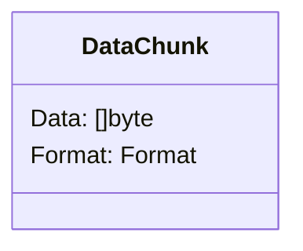
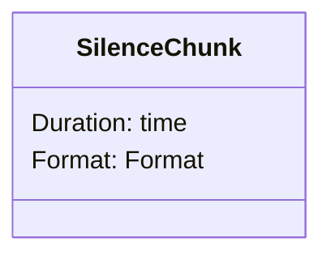
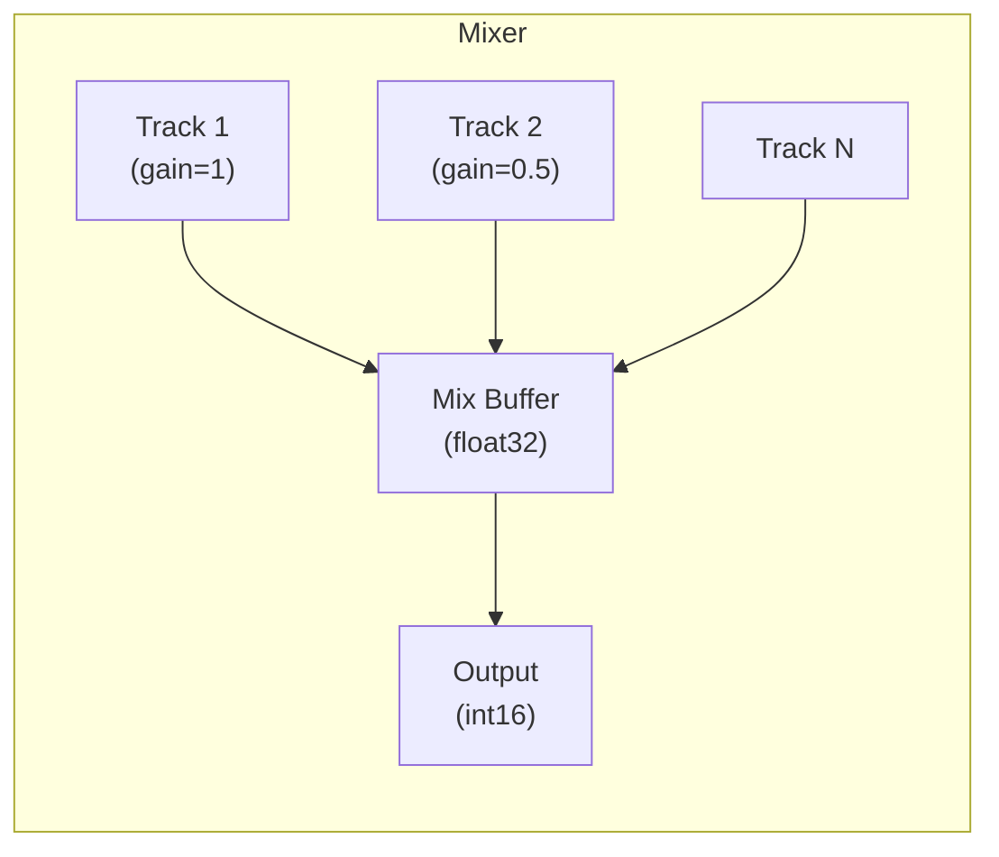

# Audio PCM Module

PCM (Pulse Code Modulation) audio format handling, chunks, and multi-track mixing.

## Design Goals

1. **Standard Formats**: Predefined configurations for common use cases
2. **Chunk Abstraction**: Unified interface for audio data and silence
3. **Real-time Mixing**: Low-latency multi-track audio mixing with gain control
4. **Streaming Interface**: Compatible with io.Reader/io.Writer patterns

## Predefined Formats

| Format | Sample Rate | Channels | Bit Depth | Bytes/sec |
|--------|-------------|----------|-----------|-----------|
| `L16Mono16K` | 16000 Hz | 1 | 16-bit | 32,000 |
| `L16Mono24K` | 24000 Hz | 1 | 16-bit | 48,000 |
| `L16Mono48K` | 48000 Hz | 1 | 16-bit | 96,000 |

## Duration/Bytes Calculations

For `L16Mono16K` (16kHz, 16-bit mono):

| Duration | Samples | Bytes |
|----------|---------|-------|
| 20ms | 320 | 640 |
| 50ms | 800 | 1,600 |
| 100ms | 1,600 | 3,200 |
| 1s | 16,000 | 32,000 |

Formula: `bytes = samples × channels × (bit_depth / 8)`

## Chunk Types

### DataChunk

Raw audio data with format metadata.



### SilenceChunk

Generates silence (zeros) of specified duration without allocating.



## Mixer Architecture

Multi-track audio mixer with real-time mixing and gain control:



**Features:**
- Dynamic track creation/removal
- Per-track gain control (0.0 - 1.0+)
- Silence gap detection
- Auto-close when all tracks done
- Thread-safe operations

## Mixing Algorithm

1. Convert int16 PCM to float32 (-1.0 to 1.0)
2. Apply per-track gain
3. Sum all track samples
4. Clip to [-1.0, 1.0]
5. Convert back to int16

```
output = clip(Σ(track[i] × gain[i]), -1.0, 1.0) × 32767
```

## Use Cases

### Voice Chat Mixing

Multiple participants' audio mixed into single output stream.

### Background Music

Mix background music track with voice at lower gain.

### Audio Ducking

Reduce music volume when voice is detected.

## Examples

See parent `audio/` documentation for usage examples.

## Related Modules

- `audio/codec/` - Encode/decode before/after mixing
- `audio/resampler/` - Convert sample rates before mixing
- `buffer/` - Buffer audio data between processing stages
