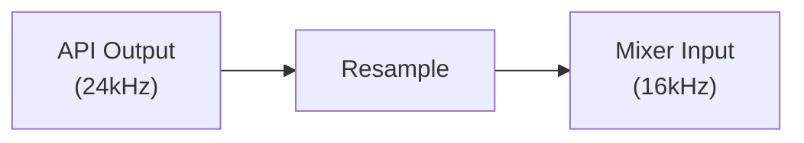
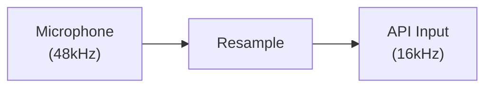
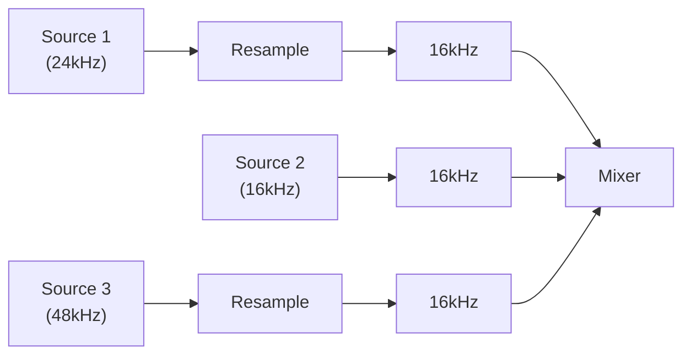

# Audio Resampler Module

Sample rate conversion using libsoxr (SoX Resampler Library).

## Design Goals

1. **High Quality**: Professional-grade resampling via libsoxr
2. **Streaming**: Process audio as continuous stream, not files
3. **Channel Conversion**: Support mono↔stereo conversion
4. **io.Reader Interface**: Drop-in replacement for audio sources

## Supported Conversions

### Sample Rate

Any integer sample rate to any other integer sample rate:
- 8000 Hz ↔ 16000 Hz ↔ 24000 Hz ↔ 48000 Hz
- Non-standard rates supported

### Channel Conversion

| From | To | Method |
|------|-----|--------|
| Mono | Stereo | Duplicate |
| Stereo | Mono | Average (L+R)/2 |

## Quality Levels

libsoxr supports multiple quality presets:

| Level | Name | Description |
|-------|------|-------------|
| 0 | Quick | Low quality, fast |
| 1 | Low | Better than quick |
| 2 | Medium | Balance of quality/speed |
| 3 | High | Good quality (default) |
| 4 | Very High | Best quality |

**Note:** Current implementation uses High quality by default.

## Algorithm

libsoxr uses polyphase filter banks with configurable:
- Passband rolloff
- Stop-band attenuation
- Linear/minimum phase

The High quality preset provides:
- Passband: 0-0.91 Nyquist
- Stop-band attenuation: -100 dB
- Linear phase

## Common Resampling Scenarios

### Speech API to Local Playback

### Local Capture to Speech API

### Multi-source Mixing

## Performance Characteristics

Approximate cycles per sample (on modern CPU):
- Quick: ~10
- High: ~50-100
- Very High: ~200-500

For real-time 16kHz mono:
- 16000 samples/sec × 100 cycles ≈ 1.6M cycles/sec
- Negligible CPU load on modern hardware

## Memory Usage

libsoxr maintains internal buffers for filter state:
- ~10-50KB per resampler instance
- More for higher quality settings

## Examples

See parent `audio/` documentation for usage examples.

## Related Modules

- `audio/pcm/` - Format definitions, use with resampler
- `audio/codec/` - Often resample before/after encoding
