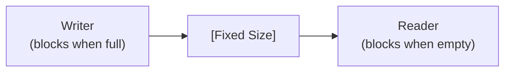
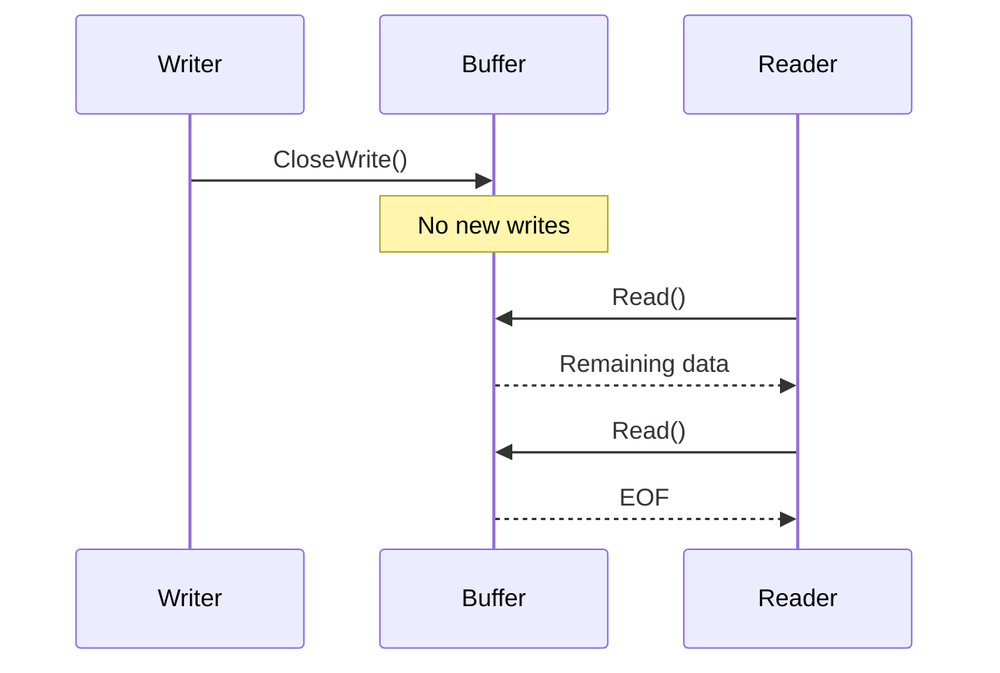
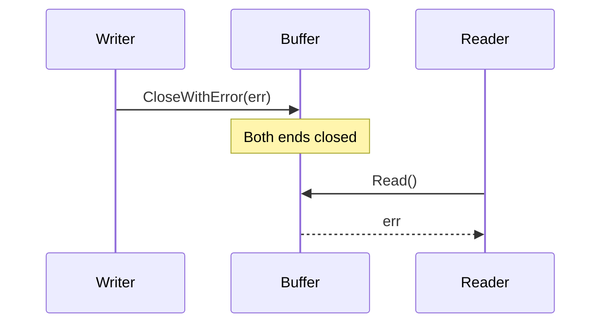

# Buffer Package

Thread-safe streaming buffer implementations for producer-consumer patterns.

## Design Goals

1. **Type-safe**: Generic buffers for any element type (not limited to bytes)
2. **Thread-safe**: All operations support concurrent access
3. **Blocking Semantics**: Support blocking read/write with proper close mechanics
4. **Flow Control**: Different policies for handling full buffers

## Buffer Types

| Type | Full Behavior | Empty Behavior | Use Case |
|------|---------------|----------------|----------|
| **Buffer** | Grow | Block | Variable-size data, unknown total size |
| **BlockBuffer** | Block | Block | Flow control, bounded memory |
| **RingBuffer** | Overwrite | Block | Sliding window, latest data only |

### Buffer (Growable)

A dynamically growing buffer that never blocks writes. Ideal for scenarios where:
- Data size is not known in advance
- Memory is not constrained
- Writer should never block

### BlockBuffer (Fixed, Blocking)

A fixed-size circular buffer that blocks on both read and write. Provides backpressure for flow control:
- Writer blocks when buffer is full
- Reader blocks when buffer is empty
- Predictable memory usage

### RingBuffer (Fixed, Overwriting)

A fixed-size circular buffer that overwrites oldest data when full. Ideal for:
- Maintaining a sliding window of latest data
- Real-time data where older samples are stale
- Memory-bounded with freshness priority

## Common Interface

All buffer types share a consistent interface:

| Operation | Description |
|-----------|-------------|
| `Write([]T)` | Write slice of elements |
| `Read([]T)` | Read into slice |
| `Add(T)` | Add single element |
| `Next()` | Read single element (iterator pattern) |
| `Discard(n)` | Skip n elements without reading |
| `Len()` | Current element count |
| `Reset()` | Clear all data |
| `CloseWrite()` | Graceful close (allow drain) |
| `CloseWithError(err)` | Immediate close with error |
| `Close()` | Close both ends |
| `Error()` | Get close error (if any) |

## Close Semantics

### CloseWrite() - Graceful

### CloseWithError(err) - Immediate

## Examples Directory

- `examples/go/buffer/` - Go usage examples
- `examples/rust/buffer/` - Rust usage examples

## Implementation Notes

### Memory Layout

| Type | Layout |
|------|--------|
| Buffer | Dynamic slice → grows via append |
| BlockBuffer | Fixed circular → head/tail pointers wrap |
| RingBuffer | Fixed circular → overwrites when head catches tail |

### Notification Mechanism

- **Go**: Channel-based (`writeNotify chan struct{}`) or Cond variables
- **Rust**: Condvar-based (`Condvar::notify_one/all`)

### Thread Safety

- **Go**: `sync.Mutex` + `sync.Cond` / channels
- **Rust**: `Mutex<State>` + `Condvar`, wrapped in `Arc` for cloning

## Related Packages

- `audio/pcm` - Uses buffers for PCM audio streams
- `chatgear` - Uses buffers for audio frame transmission
- `opusrt` - Uses RingBuffer for jitter buffering
