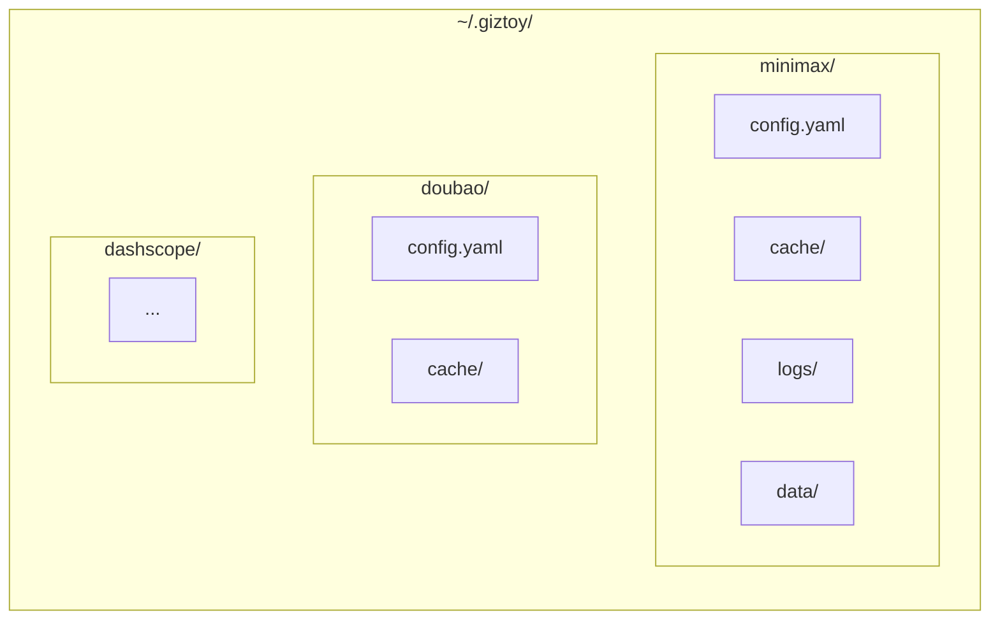

# CLI Package

Common CLI utilities for giztoy command-line tools.

## Design Goals

1. **Consistent UX**: Shared patterns across all giztoy CLI tools
2. **kubectl-style Contexts**: Multiple API configurations with context switching
3. **Flexible Output**: Support JSON, YAML, and raw output formats
4. **Cross-Platform Paths**: Standard directory structure for config/cache/logs

## Components

| Component | Description |
|-----------|-------------|
| **Config** | Multi-context configuration management |
| **Output** | Output formatting (JSON, YAML, raw) |
| **Paths** | Directory structure (~/.giztoy/<app>/) |
| **Request** | Load request data from YAML/JSON files |
| **LogWriter** | Capture logs for TUI display |

## Directory Structure



## Configuration Format

```yaml
current_context: production

contexts:
  production:
    name: production
    api_key: "sk-..."
    base_url: "https://api.example.com"
    timeout: 30
    extra:
      region: "us-west"
  
  development:
    name: development
    api_key: "sk-dev-..."
    base_url: "https://dev-api.example.com"
```

## Context System

Similar to kubectl, supports multiple API contexts:

```bash
# List contexts
myapp config list

# Use a context
myapp config use production

# Add a context
myapp config add staging --api-key=sk-...

# Delete a context
myapp config delete staging
```

## Output Formats

| Format | Flag | Description |
|--------|------|-------------|
| YAML | `--output=yaml` | Default, human-readable |
| JSON | `--output=json` | Machine-readable |
| Raw | `--output=raw` | Binary/raw data |

## Use Cases

### API CLI Tools

```bash
# minimax CLI
minimax chat "Hello" --context=production --output=json

# doubao CLI  
doubao tts "Hello world" --output=audio.mp3
```

### Configuration Management

```bash
# View current config
myapp config show

# Set default voice
myapp config set default_voice "zh-CN-Standard-A"
```

## Examples Directory

- `go/cmd/minimax/` - MiniMax CLI using this package
- `go/cmd/doubaospeech/` - Doubao Speech CLI
- `rust/cmd/minimax/` - Rust MiniMax CLI

## Related Packages

- Used by all CLI tools in the project
- Provides consistent user experience across Go and Rust implementations
