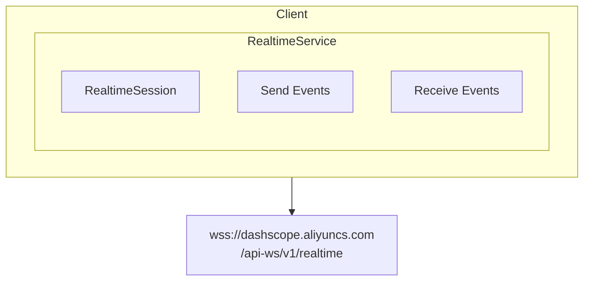
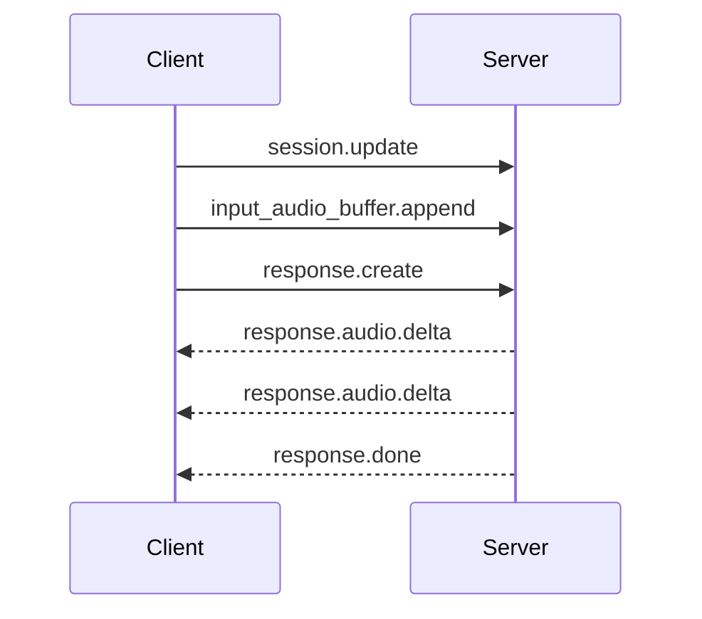

# DashScope SDK

Go and Rust SDK for Aliyun DashScope (百炼 Model Studio) APIs.

> **Official API Documentation**: [api/README.md](./api/README.md)

## Design Goals

1. **Realtime Focus**: Primarily implement Qwen-Omni-Realtime WebSocket API
2. **OpenAI Compatibility**: Text/chat APIs use OpenAI-compatible SDK
3. **Native WebSocket**: Direct WebSocket implementation, not polling

## Scope

This SDK focuses on **Qwen-Omni-Realtime** API for real-time multimodal conversation. For standard text APIs, use OpenAI-compatible SDKs.

| API | SDK Coverage | Alternative |
|-----|:------------:|-------------|
| Text Chat | ❌ | OpenAI SDK with custom base URL |
| App/Agent | ❌ | Direct HTTP calls |
| Realtime | ✅ | **This SDK** |

## API Coverage

| Feature | Go | Rust | Official Doc |
|---------|:--:|:----:|--------------|
| Realtime Session | ✅ | ✅ | [api/realtime/](./api/realtime/) |
| Audio Input/Output | ✅ | ✅ | |
| Function Calls | ✅ | ✅ | |
| Text Input | ✅ | ✅ | |
| Video Input | ⚠️ | ⚠️ | Limited support |

## Architecture



## Authentication

```
Authorization: Bearer <api_key>
```

Optional workspace isolation:
```
X-DashScope-WorkSpace: <workspace_id>
```

## Base URLs

| Region | WebSocket URL |
|--------|---------------|
| China (Beijing) | `wss://dashscope.aliyuncs.com/api-ws/v1/realtime` |
| International (Singapore) | `wss://dashscope-intl.aliyuncs.com/api-ws/v1/realtime` |

## Models

| Model | Input | Output | Sample Rate |
|-------|-------|--------|-------------|
| `qwen-omni-turbo-realtime` | audio/text | audio/text | 16kHz |
| `qwen3-omni-flash-realtime` | audio/text/video | audio/text | 24kHz |

## Event Flow



## Examples Directory

- `examples/go/dashscope/` - Go SDK examples
- `examples/cmd/dashscope/` - CLI test scripts

## For Text/Chat APIs

Use OpenAI-compatible SDK:

**Go:**
```go
import "github.com/sashabaranov/go-openai"

config := openai.DefaultConfig(apiKey)
config.BaseURL = "https://dashscope.aliyuncs.com/compatible-mode/v1"
client := openai.NewClientWithConfig(config)
```

**Rust:**
```rust
// Use async-openai with custom base URL
```

## Related

- CLI tool: `go/cmd/dashscope/`
- CLI tests: `examples/cmd/dashscope/`
