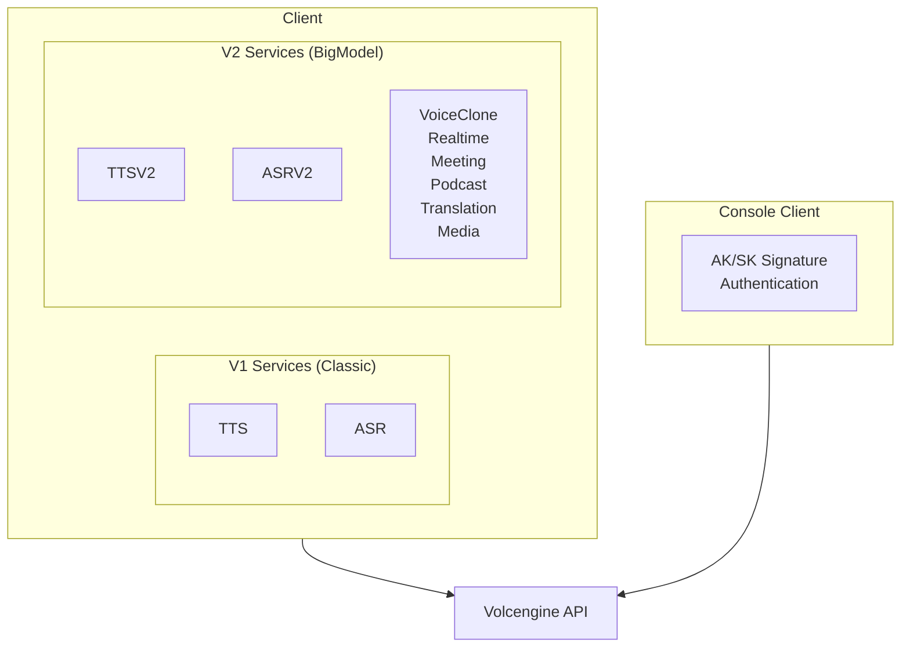

# Doubao Speech SDK

Go and Rust SDK for Volcengine Doubao Speech API (豆包语音).

> **Official API Documentation**: [api/README.md](./api/README.md)

## Design Goals

1. **Dual API Version Support**: V1 (Classic) and V2/V3 (BigModel) APIs
2. **Multiple Auth Methods**: Bearer Token, API Key, V2 API Key
3. **Comprehensive Coverage**: TTS, ASR, Voice Clone, Realtime, Meeting, Podcast, etc.
4. **Streaming-first**: WebSocket-based streaming for real-time scenarios

---

## Service and API Version Reference

| Service | API Version | Endpoint | Resource ID | Protocol |
|---------|-------------|----------|-------------|----------|
| **TTS V1** | Classic | `POST /api/v1/tts` | cluster=`volcano_tts` | HTTP |
| **TTS V2 HTTP Stream** | BigModel | `POST /api/v3/tts/unidirectional` | `seed-tts-1.0` / `seed-tts-2.0` | HTTP SSE |
| **TTS V2 WS Unidirectional** | BigModel | `WSS /api/v3/tts/unidirectional` | same as above | WebSocket |
| **TTS V2 WS Bidirectional** | BigModel | `WSS /api/v3/tts/bidirection` | same as above | WebSocket |
| **TTS V2 Async** | BigModel | `POST /api/v3/tts/async/submit` | `seed-tts-2.0-concurr` | HTTP |
| **ASR V1** | Classic | `POST /api/v1/asr` | cluster=`volcengine_*` | HTTP |
| **ASR V2 Stream** | BigModel | `WSS /api/v3/sauc/bigmodel` | `volc.bigasr.sauc.duration` | WebSocket |
| **ASR V2 File** | BigModel | `POST /api/v3/auc/submit` | `volc.bigasr.auc.duration` | HTTP |
| **Podcast HTTP** | V1 | `POST /api/v1/podcast/submit` | N/A | HTTP |
| **SAMI Podcast WS** | V3 | `WSS /api/v3/sami/podcasttts` | `volc.service_type.10050` | WebSocket |
| **Realtime Dialogue** | V3 | `WSS /api/v3/realtime/dialogue` | `volc.speech.dialog` | WebSocket |
| **Voice Clone** | V3 | See Console API | `seed-icl-1.0` / `seed-icl-2.0` | HTTP |
| **Translation** | V3 | `WSS /api/v3/simt/*` | `volc.megatts.simt` | WebSocket |

---

## Complete Resource ID Reference

### TTS Services

| Resource ID | Alias | Description | Required Speaker Suffix |
|-------------|-------|-------------|------------------------|
| `seed-tts-1.0` | `volc.service_type.10029` | TTS BigModel 1.0 (per-char) | `_moon_bigtts` |
| `seed-tts-1.0-concurr` | `volc.service_type.10048` | TTS BigModel 1.0 (concurrent) | `_moon_bigtts` |
| `seed-tts-2.0` | - | TTS BigModel 2.0 (per-char) | `_uranus_bigtts` |
| `seed-tts-2.0-concurr` | - | TTS BigModel 2.0 (concurrent) | `_uranus_bigtts` |
| `seed-icl-1.0` | - | Voice Clone 1.0 (per-char) | cloned voices |
| `seed-icl-2.0` | - | Voice Clone 2.0 (per-char) | `_saturn_bigtts` |

### ASR Services

| Resource ID | Description |
|-------------|-------------|
| `volc.bigasr.sauc.duration` | BigModel Streaming ASR (duration-based) |
| `volc.bigasr.auc.duration` | BigModel File ASR (duration-based) |

### Other Services

| Resource ID | Description |
|-------------|-------------|
| `volc.speech.dialog` | End-to-end Realtime Voice Model |
| `volc.service_type.10050` | SAMI Podcast Synthesis |
| `volc.megatts.podcast` | Podcast (alternative ID) |
| `volc.megatts.simt` | Simultaneous Translation |

---

## Speaker Naming Rules (IMPORTANT!)

> ⚠️ **Critical Issue**: The official documentation does not clearly state the mapping between speaker suffix and Resource ID. The following rules were discovered through testing.

| Speaker Suffix | Required Resource ID | Example Speaker | Description |
|----------------|---------------------|-----------------|-------------|
| No suffix | V1 `cluster=volcano_tts` | `zh_female_cancan` | TTS 1.0 classic voice |
| `_moon_bigtts` | `seed-tts-1.0` | `zh_female_shuangkuaisisi_moon_bigtts` | TTS 1.0 BigModel voice |
| `_uranus_bigtts` | `seed-tts-2.0` | `zh_female_xiaohe_uranus_bigtts` | TTS 2.0 BigModel voice ✅ |
| `_mars_bigtts` | Unknown | `zh_female_cancan_mars_bigtts` | May require special permissions |
| `_saturn_bigtts` | `seed-icl-*` or Podcast | `zh_female_xxx_saturn_bigtts` | Voice Clone / Podcast |
| `_v2_saturn_bigtts` | `volc.service_type.10050` | `zh_male_dayixiansheng_v2_saturn_bigtts` | SAMI Podcast only |

### Common Error

```json
{"code": 55000000, "message": "resource ID is mismatched with speaker related resource"}
```

**Meaning**: The speaker suffix doesn't match the Resource ID. This is NOT "service not enabled"!

### Verified Working Combinations

| Resource ID | Working Speaker |
|-------------|-----------------|
| `seed-tts-2.0` | `zh_female_xiaohe_uranus_bigtts` ✅ |
| `seed-tts-2.0` | `zh_female_vv_uranus_bigtts` ✅ |
| `seed-tts-2.0` | `zh_male_taocheng_uranus_bigtts` ✅ |
| `seed-tts-1.0` | `zh_female_shuangkuaisisi_moon_bigtts` ✅ |
| `volc.service_type.10050` | `zh_male_dayixiansheng_v2_saturn_bigtts` ✅ |
| `volc.service_type.10050` | `zh_female_mizaitongxue_v2_saturn_bigtts` ✅ |

---

## Authentication Reference

### V1 API (Classic)

| Header | Value | Description |
|--------|-------|-------------|
| `Authorization` | `Bearer {token}` | Bearer Token authentication |

### V2/V3 API (BigModel)

| Header | Value | Description |
|--------|-------|-------------|
| `X-Api-App-Id` | `{app_id}` | Application ID |
| `X-Api-Access-Key` | `{token}` | Access Token |
| `X-Api-Resource-Id` | `{resource_id}` | Resource ID |

### Special Services (Fixed App-Key Required)

| Service | Additional Header | Fixed Value |
|---------|------------------|-------------|
| SAMI Podcast | `X-Api-App-Key` | `aGjiRDfUWi` |
| Realtime | `X-Api-App-Key` | `BYsHlwdHqc` |

### Console API

Uses Volcengine OpenAPI AK/SK signature (HMAC-SHA256), different from Speech API authentication.

---

## CLI Command Structure (Plan A)

```
doubaospeech
├── tts
│   ├── v1
│   │   ├── synthesize          # TTS V1 sync synthesis
│   │   └── stream              # TTS V1 streaming
│   └── v2
│       ├── stream              # TTS V2 HTTP streaming
│       ├── ws                  # TTS V2 WebSocket unidirectional
│       ├── bidirectional       # TTS V2 WebSocket bidirectional
│       └── async               # TTS V2 async long text
├── asr
│   ├── v1
│   │   ├── recognize           # ASR V1 one-sentence
│   │   └── stream              # ASR V1 streaming
│   └── v2
│       ├── stream              # ASR V2 streaming
│       └── file                # ASR V2 file recognition
├── podcast
│   ├── http                    # Podcast HTTP submit
│   └── sami                    # SAMI Podcast WebSocket
├── realtime
│   └── interactive             # Real-time dialogue
├── voice
│   ├── list                    # List voices
│   ├── clone                   # Voice cloning
│   └── status                  # Query status
└── config
    ├── init                    # Initialize config
    ├── view                    # View config
    └── set                     # Set config
```

### Command Examples

```bash
# TTS V2 HTTP streaming (recommended)
doubaospeech tts v2 stream -f tts.yaml -o output.mp3

# TTS V2 WebSocket bidirectional
doubaospeech tts v2 bidirectional -f tts.yaml -o output.mp3

# TTS V1 (legacy, not recommended)
doubaospeech tts v1 synthesize -f tts.yaml -o output.mp3

# ASR V2 streaming
doubaospeech asr v2 stream -f asr.yaml

# SAMI Podcast
doubaospeech podcast sami -f podcast.yaml -o output.mp3
```

### Request File Example

**TTS V2 Request (tts.yaml)**:
```yaml
text: "Hello, this is a test."
speaker: zh_female_xiaohe_uranus_bigtts  # Note the speaker suffix!
resource_id: seed-tts-2.0                 # Must match the speaker!
format: mp3
sample_rate: 24000
```

---

## Architecture



## API Coverage

| Feature | V1 (Classic) | V2 (BigModel) | Go | Rust |
|---------|:------------:|:-------------:|:--:|:----:|
| TTS Sync | ✅ | ✅ | ✅ | ✅ |
| TTS Stream | ✅ | ✅ | ✅ | ✅ |
| TTS Async (Long Text) | ✅ | ✅ | ⚠️ | ⚠️ |
| TTS WS Bidirectional | N/A | ✅ | ✅ | ✅ |
| ASR One-sentence | ✅ | ✅ | ✅ | ✅ |
| ASR Stream | ✅ | ✅ | ✅ | ✅ |
| ASR File | ✅ | ✅ | ✅ | ✅ |
| Voice Clone | N/A | ✅ | ✅ | ✅ |
| Realtime Dialogue | N/A | ✅ | ✅ | ✅ |
| Meeting Transcription | N/A | ✅ | ✅ | ✅ |
| Podcast Synthesis | N/A | ✅ | ✅ | ✅ |
| Translation (SIMT) | N/A | ✅ | ✅ | ✅ |
| Media Subtitle | N/A | ✅ | ✅ | ✅ |
| Console API | N/A | ✅ | ✅ | ✅ |

> ⚠️ TTS Async (Long Text) has CLI commands in both Go and Rust but SDK implementation is not complete

---

## Examples Directory

- `examples/go/doubaospeech/` - Go SDK examples
- `e2e/cmd/doubaospeech/` - CLI test scripts

## Related

- Go CLI tool: `go/cmd/doubaospeech/`
- Rust CLI tool: `rust/cmd/doubaospeech/`
- CLI test scripts: `e2e/cmd/doubaospeech/`
- AI Development Guide (Go): `go/pkg/doubaospeech/AGENTS.md`
