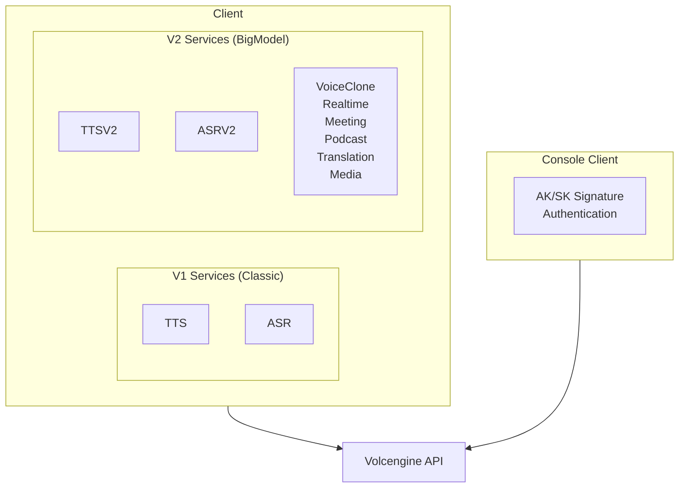

# Doubao Speech SDK

Go and Rust SDK for Volcengine Doubao Speech API (豆包语音).

> **Official API Documentation**: [api/README.md](./api/README.md)

## Design Goals

1. **Dual API Version Support**: V1 (Classic) and V2/V3 (BigModel) APIs
2. **Multiple Auth Methods**: Bearer Token, API Key, V2 API Key
3. **Comprehensive Coverage**: TTS, ASR, Voice Clone, Realtime, Meeting, Podcast, etc.
4. **Streaming-first**: WebSocket-based streaming for real-time scenarios

## API Versions

Doubao Speech has two API generations:

| Version | Name | Features | Recommended |
|---------|------|----------|-------------|
| V1 | Classic | Basic TTS/ASR | Legacy use |
| V2/V3 | BigModel | Advanced TTS/ASR, Realtime | ✅ New projects |

## API Coverage

| Feature | V1 (Classic) | V2 (BigModel) | Go | Rust |
|---------|:------------:|:-------------:|:--:|:----:|
| TTS Sync | ✅ | ✅ | ✅ | ✅ |
| TTS Stream | ✅ | ✅ | ✅ | ✅ |
| TTS Async (Long Text) | ✅ | ✅ | ✅ | ⚠️ |
| ASR One-sentence | ✅ | ✅ | ✅ | ✅ |
| ASR Stream | ✅ | ✅ | ✅ | ✅ |
| ASR File | ✅ | ✅ | ✅ | ⚠️ |
| Voice Clone | N/A | ✅ | ✅ | ✅ |
| Realtime Dialogue | N/A | ✅ | ✅ | ✅ |
| Meeting Transcription | N/A | ✅ | ✅ | ✅ |
| Podcast Synthesis | N/A | ✅ | ✅ | ✅ |
| Translation (SIMT) | N/A | ✅ | ✅ | ✅ |
| Media Subtitle | N/A | ✅ | ✅ | ✅ |
| Console API | N/A | ✅ | ✅ | ✅ |

## Architecture

## Authentication Methods

### Speech API Client

| Method | Header | Use Case |
|--------|--------|----------|
| API Key | `x-api-key: {key}` | Simplest, recommended |
| Bearer Token | `Authorization: Bearer;{token}` | V1 APIs |
| V2 API Key | `X-Api-Access-Key`, `X-Api-App-Key` | V2/V3 APIs |

### Console Client

Uses Volcengine OpenAPI AK/SK signature (HMAC-SHA256).

## Resource IDs (V2/V3)

| Service | Resource ID |
|---------|-------------|
| TTS 2.0 | `seed-tts-2.0` |
| TTS 2.0 Concurrent | `seed-tts-2.0-concurr` |
| ASR Stream | `volc.bigasr.sauc.duration` |
| ASR File | `volc.bigasr.auc.duration` |
| Realtime | `volc.speech.dialog` |
| Podcast | `volc.service_type.10050` |
| Translation | `volc.megatts.simt` |
| Voice Clone | `seed-icl-2.0` |

## Clusters (V1)

| Cluster | Service |
|---------|---------|
| `volcano_tts` | TTS Standard |
| `volcano_mega` | TTS BigModel |
| `volcano_icl` | Voice Clone |
| `volcengine_streaming_common` | ASR Streaming |

## Examples Directory

- `examples/go/doubaospeech/` - Go SDK examples
- `examples/cmd/doubaospeech/` - CLI test scripts

## Related

- CLI tool: `go/cmd/doubaospeech/`
- CLI tests: `examples/cmd/doubaospeech/`
