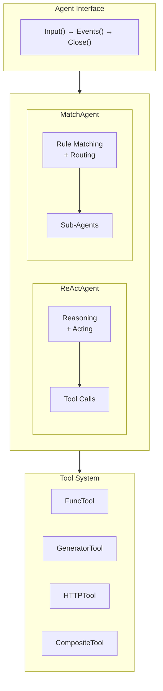
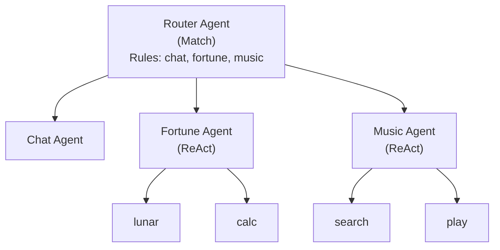

# GenX Agent Framework

Framework for building LLM-powered autonomous agents.

> **Note:** This package is Go-only. No Rust implementation exists.

## Design Goals

1. **Flexible Agent Architecture**: Support multiple agent patterns
2. **Event-Based API**: Fine-grained control over agent execution
3. **Tool Orchestration**: Rich tool ecosystem for agents
4. **Multi-Skill Assistants**: Router agents for complex workflows

## Agent Types

### ReActAgent

Implements the Reasoning and Acting (ReAct) pattern:
- Thinks step-by-step about user requests
- Selects and executes tools to accomplish tasks
- Iterative reasoning until task completion

### MatchAgent

Implements intent-based routing:
- Matches user input against predefined rules
- Routes to appropriate sub-agents or actions
- Useful for building multi-skill assistants

## Architecture



## Event System

Agents communicate through events:

| Event | Description |
|-------|-------------|
| `EventChunk` | Output text chunk |
| `EventEOF` | Round ended, waiting for input |
| `EventClosed` | Agent completed (quit tool called) |
| `EventToolStart` | Tool execution started |
| `EventToolDone` | Tool completed successfully |
| `EventToolError` | Tool execution failed |
| `EventInterrupted` | Agent was interrupted |

## Tool Types

| Tool | Description |
|------|-------------|
| `BuiltinTool` | Wraps Go functions |
| `GeneratorTool` | LLM-based generation |
| `HTTPTool` | HTTP requests with jq extraction |
| `CompositeTool` | Sequential tool pipeline |
| `TextProcessorTool` | Text manipulation |

## Quit Tools

Tools can signal agent completion:

```yaml
tools:
  - $ref: tool:goodbye
    quit: true
```

When executed, the agent finishes and returns `EventClosed`.

## Multi-Skill Assistant Pattern



## Related

- Configuration: [../agentcfg/](../agentcfg/)
- Pattern matching: [../match/](../match/)
