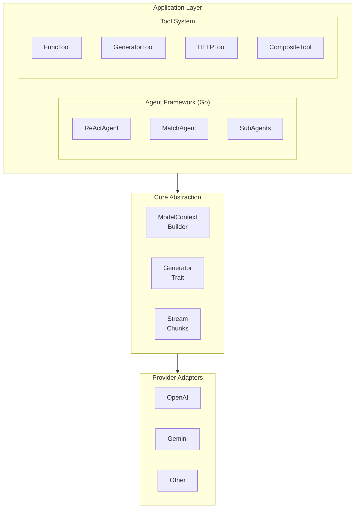

# GenX - Universal LLM Interface

GenX is a universal abstraction layer for Large Language Models (LLMs).

## Design Goals

1. **Provider Agnostic**: Single API for OpenAI, Gemini, and other providers
2. **Streaming First**: Native support for streaming responses
3. **Tool Orchestration**: Rich function calling and tool management
4. **Agent Framework**: Build autonomous AI agents (Go only)

## Architecture



## Core Concepts

### ModelContext

Contains all inputs for LLM generation:
- **Prompts**: System instructions (named prompts)
- **Messages**: Conversation history
- **Tools**: Available function definitions
- **Params**: Model parameters (temperature, max_tokens, etc.)
- **CoTs**: Chain-of-thought examples

### Generator

Interface for LLM providers:
- `GenerateStream()`: Streaming text generation
- `Invoke()`: Structured function call

### Stream

Streaming response handler:
- `Next()`: Get next message chunk
- `Close()`: Close stream
- `CloseWithError()`: Close with error

### Message Types

| Type | Description |
|------|-------------|
| `user` | User input |
| `assistant` | Model response |
| `system` | System prompt (in messages) |
| `tool` | Tool call/result |

### Content Types

| Type | Description |
|------|-------------|
| `Text` | Plain text |
| `Blob` | Binary data (images, audio) |
| `ToolCall` | Function call request |
| `ToolResult` | Function call response |

## Agent Framework (Go only)

### Agent Types

| Agent | Description |
|-------|-------------|
| `ReActAgent` | Reasoning + Acting pattern |
| `MatchAgent` | Intent-based routing |

### Tool Types

| Tool | Description |
|------|-------------|
| `FuncTool` | Go function wrapper |
| `GeneratorTool` | LLM-based generation |
| `HTTPTool` | HTTP requests |
| `CompositeTool` | Tool pipeline |
| `TextProcessorTool` | Text manipulation |

### Event System

Agents emit events for fine-grained control:
- `EventChunk`: Output chunk
- `EventEOF`: Round ended
- `EventClosed`: Agent completed
- `EventToolStart`: Tool execution started
- `EventToolDone`: Tool completed
- `EventToolError`: Tool failed
- `EventInterrupted`: Interrupted

## Configuration (agentcfg)

YAML/JSON configuration for agents and tools:

```yaml
type: react
name: assistant
prompt: |
  You are a helpful assistant.
generator:
  model: gpt-4
tools:
  - $ref: tool:search
  - $ref: tool:calculator
```

Supports `$ref` for reusable components.

## Provider Support

| Provider | Go | Rust |
|----------|:--:|:----:|
| OpenAI | ✅ | ✅ |
| Gemini | ✅ | ✅ |
| Compatible APIs | ✅ | ✅ |

## Examples Directory

- `examples/go/genx/` - Go examples
- `examples/rust/genx/` - Rust examples
