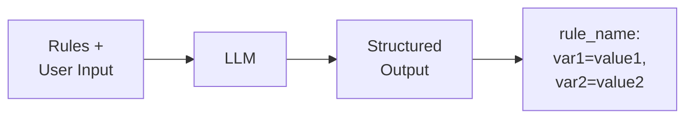
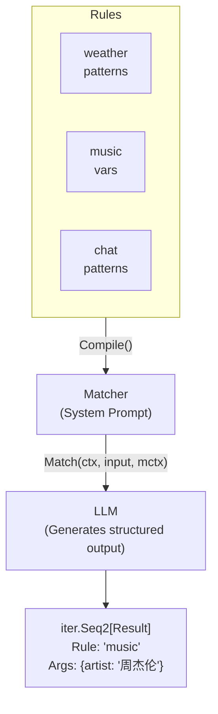

# GenX Match - Pattern Matching Engine

LLM-based intent recognition and pattern matching.

> **Note:** This package is Go-only. No Rust implementation exists.

## Design Goals

1. **Intent Recognition**: Match user input to predefined intents
2. **Variable Extraction**: Extract structured data from natural language
3. **Streaming Output**: Process matches as they arrive
4. **LLM-Powered**: Use LLM for flexible matching

## How It Works



1. **Compile**: Rules are compiled into a system prompt
2. **Match**: User input is sent to LLM with the prompt
3. **Parse**: Output lines are parsed into structured Results

## Rule Definition

### Basic Rule

```yaml
name: weather
patterns:
  - 查天气
  - 今天天气怎么样
  - 明天下雨吗
```

### Rule with Variables

```yaml
name: music
vars:
  title:
    label: 歌曲名
    type: string
  artist:
    label: 歌手
    type: string
patterns:
  - 播放歌曲
  - 我想听歌
  - ["我想听[title]", "title=[歌曲名]"]
  - ["我想听[artist]的歌", "artist=[歌手]"]
  - ["我想听[artist]的[title]", "artist=[歌手], title=[歌曲名]"]
```

### Pattern Format

| Format | Description | Example |
|--------|-------------|---------|
| String | Simple pattern, no vars | `"播放歌曲"` |
| Array `[input, output]` | Pattern with expected output | `["我想听[title]", "title=[歌曲名]"]` |

## Output Format

LLM outputs one line per match:

```
rule_name: var1=value1, var2=value2
```

Examples:
- `weather` (no variables)
- `music: artist=周杰伦` (one variable)
- `music: artist=周杰伦, title=稻香` (multiple variables)

## Variable Types

| Type | Description | Parsing |
|------|-------------|---------|
| `string` | Text (default) | As-is |
| `int` | Integer | `strconv.ParseInt` |
| `float` | Floating point | `strconv.ParseFloat` |
| `bool` | Boolean | `strconv.ParseBool` |

## Architecture



## Integration with MatchAgent

The match package is used by MatchAgent for intent routing:

```yaml
# MatchAgent config
type: match
name: router
rules:
  - $ref: rule:weather
  - $ref: rule:music
route:
  - rules: [weather]
    agent: $ref: agent:weather_assistant
  - rules: [music]
    agent: $ref: agent:music_player
```

## Related

- Agent framework: [../agent/](../agent/)
- Configuration: [../agentcfg/](../agentcfg/)
