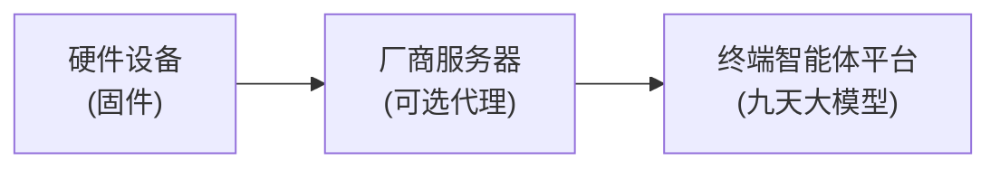

# 九天大模型接入教程

本教程介绍如何将硬件设备接入中国移动终端智能体服务管理平台，并调用九天大模型 API。

## 整体架构



**两种接入方式**：
- **设备直连**：设备直接调用平台 API
- **服务器代理**：厂商服务器代替设备调用 API（需传 `X-AI-IP` 头）

## 配置参数清单

接入前需要准备以下参数：

### 产品级参数（平台获取）

| 参数 | 说明 | 获取方式 | 用途 |
| --- | --- | --- | --- |
| `productId` | 产品 ID | 平台创建产品时生成 | 设备注册、心跳上报、AI 调用 |
| `productKey` | 产品密钥 | 平台创建产品时生成 | 设备注册、心跳上报 |
| `apiToken` | AI 服务 Token | 邮件申请 | AI 调用鉴权 |

### 设备级参数

| 参数 | 说明 | 获取方式 | 用途 |
| --- | --- | --- | --- |
| `deviceNo` | 设备号 | 设备自身（SN/IMEI/CMEI 三选一） | 设备注册 |
| `deviceId` | 设备 ID | 调用设备注册接口返回 | 心跳上报、AI 调用 |
| `deviceSecret` | 设备密钥 | 调用设备注册接口返回 | 心跳上报 |

### 设备号类型说明

| 类型 | 说明 | 适用设备 |
| --- | --- | --- |
| `SN` | 序列号 | 通用 |
| `IMEI` | 国际移动设备识别码（15位） | 蜂窝类产品（4G/5G） |
| `CMEI` | 中国移动设备识别码（15位） | 非蜂窝类产品（WiFi 设备） |

#### IMEI vs CMEI 详解

**结构对比**（两者格式相同，仅前 8 位来源不同）：

```
IMEI = 8位 TAC + 6位序列号 + 1位校验码
CMEI = 8位 TUI + 6位序列号 + 1位校验码
```

| 前缀 | 全称 | 分配机构 | 适用场景 |
| --- | --- | --- | --- |
| TAC | Type Allocation Code | GSMA（国际） | 蜂窝设备 |
| TUI | Terminal Unique Identifier | 中国移动 | 非蜂窝设备 |

#### 设备号获取方式

| 设备类型 | 设备号 | 如何获取 | 是否需要生成 |
| --- | --- | --- | --- |
| **使用蜂窝模组**（4G/5G） | IMEI | 直接读取模组的 IMEI | ❌ 不需要，模组出厂自带 |
| **自研蜂窝设备**（自做基带） | IMEI | 向 GSMA 申请 TAC 后生成 | ✅ 需要（罕见场景） |
| **纯 WiFi 设备** | CMEI | 向中国移动申请 TUI 后生成 | ✅ 需要 |

> **常见情况**：大多数厂商使用移远、广和通等模组，模组已有 IMEI，直接读取使用即可。
> 
> **CMEI 生成**：仅 WiFi 设备需要。需向中国移动申请 TUI 码，按模板批量生成 CMEI，
> 并在销售发货前上传至移动一级库。

### 服务器配置（服务器代理模式）

| 参数 | 说明 | 获取方式 |
| --- | --- | --- |
| 服务器 IP | 厂商服务器公网 IP | 自有服务器 |
| 白名单 | IP 访问权限 | 邮件申请开通 |

### 配置示例

```yaml
# config.yaml 示例
product:
  id: "1234567890123"        # productId - 平台创建
  key: "abcdefghijk"         # productKey - 平台创建
  
device:
  no: "SN123456789"          # 设备序列号
  no_type: "SN"              # SN / IMEI / CMEI
  # 以下两个参数通过注册接口获取，需要持久化存储
  id: ""                     # deviceId - 注册后获得
  secret: ""                 # deviceSecret - 注册后获得

ai:
  token: "sk-xxxxx"          # apiToken - 邮件申请
  base_url: "https://ivs.chinamobiledevice.com:30100"

server:
  ip: "203.0.113.50"         # 服务器代理时必传
```

---

## 前置条件

| 步骤 | 说明 | 获取方式 |
| --- | --- | --- |
| 1. 创建产品 | 获得 `productId` + `productKey` | 平台创建 |
| 2. 导入设备 | 上传设备号（SN/IMEI/CMEI） | 平台导入 |
| 3. 申请 Token | 获得 AI 服务调用凭证 | 邮件申请 |
| 4. 开通白名单 | 服务器 IP 加入白名单 | 邮件申请 |

**邮件申请**：发送至 zouyiqiang_fx@cmdc.chinamobile.com, zhucaiwen_fx@cmdc.chinamobile.com

---

## 第一步：设备注册

设备需要先在平台注册，获取 `deviceId` 和 `deviceSecret`。

### 环境地址

| 环境 | 设备管理 API |
| --- | --- |
| 测试环境 | https://62b98tux.cxzfdm.com:30101 |
| **生产环境** | https://ivs.chinamobiledevice.com:11443 |

### 1.1 获取设备信息

```bash
curl -X POST "https://ivs.chinamobiledevice.com:11443/v2/customer/device/secret/info" \
  -H "Content-Type: application/json" \
  -H "X-AI-IP: 192.168.1.100" \
  -d '{
    "deviceNoType": "SN",
    "deviceNo": "YOUR_DEVICE_SN",
    "productId": "YOUR_PRODUCT_ID",
    "productKey": "YOUR_PRODUCT_KEY"
  }'
```

**响应**：
```json
{
  "code": "200",
  "success": true,
  "data": {
    "deviceId": "abc123",
    "deviceSecret": "xyz789",
    "productId": "YOUR_PRODUCT_ID",
    "deviceNo": "YOUR_DEVICE_SN"
  }
}
```

> **注意**：
> - `X-AI-IP` 仅在服务器代理时必传
> - 设备号必须已在平台导入
> - 相同设备号每次返回相同信息，只需调用一次

### 1.2 心跳上报

设备需要 **24小时内至少上报一次** 心跳。

```bash
curl -X POST "https://ivs.chinamobiledevice.com:11443/v2/customer/device/report" \
  -H "Content-Type: application/json" \
  -H "X-AI-IP: 192.168.1.100" \
  -d '{
    "deviceId": "abc123",
    "deviceSecret": "xyz789",
    "productId": "YOUR_PRODUCT_ID",
    "productKey": "YOUR_PRODUCT_KEY",
    "params": {
      "innerIp": ["192.168.1.100"],
      "netSpeed": "0Mbps",
      "netType": "WiFi",
      "platform": "Android11",
      "sdkVersion": "ai_http_1.0",
      "firmwareVersion": "1.0.0",
      "imei": "",
      "cmei": "11123456123456X",
      "mac": "AA-BB-CC-DD-EE-FF"
    }
  }'
```

**params 字段说明**：

| 字段 | 必填 | 说明 | 无法获取时 |
| --- | --- | --- | --- |
| innerIp | 是 | 内网 IP 列表 | `["127.0.0.1"]` |
| netSpeed | 是 | 网速 | `"0Mbps"` |
| netType | 是 | 网络类型 | `"wifi"` / `"5G"` / `"ethernet"` |
| platform | 是 | 操作系统 | `"Android11"` / `"RTOS"` |
| sdkVersion | 是 | SDK 版本 | `"ai_http_1.0"` |
| firmwareVersion | 是 | 固件版本 | 实际版本号 |
| imei | 是 | IMEI（蜂窝类必传） | `""` |
| cmei | 是 | CMEI（非蜂窝类必传） | `""` |
| mac | 是 | MAC 地址 | `""` |

---

## 第二步：调用 AI 服务

完成设备注册后，即可调用九天大模型 API。

### 环境地址

| 环境 | AI 服务 API |
| --- | --- |
| 测试环境 | https://z5f3vhk2.cxzfdm.com:30101 |
| **生产环境** | https://ivs.chinamobiledevice.com:30100 |

**测试 Token**：`sk-Y73NAU0tArvGRlpUE9060529470b42Ac8bA34d40F48b0564`

### 2.1 请求头

所有 AI 请求必须包含以下 Header：

```http
Authorization: Bearer {YOUR_TOKEN}
X-AI-IP: {设备IP}
X-AI-VID: {productId}
X-AI-UID: {deviceId}
```

### 2.2 Chat Completions API

接口兼容 **OpenAI 格式**，可直接使用 OpenAI SDK。

#### 非流式请求

```bash
curl -X POST "https://ivs.chinamobiledevice.com:30100/llm/v1/chat/completions" \
  -H "Content-Type: application/json" \
  -H "Authorization: Bearer $TOKEN" \
  -H "X-AI-IP: 192.168.1.100" \
  -H "X-AI-VID: YOUR_PRODUCT_ID" \
  -H "X-AI-UID: YOUR_DEVICE_ID" \
  -d '{
    "model": "jiutian-lan",
    "messages": [
      {"role": "system", "content": "您好，我是中国移动的智能助理灵犀"},
      {"role": "user", "content": "你好，今天天气怎么样？"}
    ],
    "stream": false
  }'
```

**响应**：
```json
{
  "id": "xxx",
  "model": "jiutian-lan",
  "choices": [{
    "index": 0,
    "message": {
      "role": "assistant",
      "content": "您好！很高兴为您服务..."
    },
    "finish_reason": "stop"
  }],
  "usage": {
    "prompt_tokens": 23,
    "completion_tokens": 50,
    "total_tokens": 73
  }
}
```

#### 流式请求

```bash
curl -X POST "https://ivs.chinamobiledevice.com:30100/llm/v1/chat/completions" \
  -H "Content-Type: application/json" \
  -H "Authorization: Bearer $TOKEN" \
  -H "X-AI-VID: YOUR_PRODUCT_ID" \
  -H "X-AI-UID: YOUR_DEVICE_ID" \
  -d '{
    "model": "jiutian-lan",
    "messages": [
      {"role": "user", "content": "你好"}
    ],
    "stream": true
  }'
```

**响应**（SSE 格式）：
```
data: {"choices":[{"delta":{"content":"您好"},"index":0}]}

data: {"choices":[{"delta":{"content":"！"},"index":0}]}

data: {"choices":[{"delta":{"content":""},"finish_reason":"stop"}]}

data: [DONE]
```

### 2.3 模型选择

| 模型名称 | 说明 | 适用场景 |
| --- | --- | --- |
| `jiutian-lan` | 九天基础语言大模型 | 通用对话 |
| `jiutian-chat` | 非生成式 AI | 儿童手表等（需邮件申请） |

### 2.4 使用 OpenAI SDK

由于接口兼容 OpenAI 格式，可直接使用官方 SDK：

```python
from openai import OpenAI

client = OpenAI(
    api_key="sk-Y73NAU0tArvGRlpUE9060529470b42Ac8bA34d40F48b0564",
    base_url="https://ivs.chinamobiledevice.com:30100/llm/v1",
    default_headers={
        "X-AI-VID": "YOUR_PRODUCT_ID",
        "X-AI-UID": "YOUR_DEVICE_ID",
        "X-AI-IP": "192.168.1.100",
    }
)

response = client.chat.completions.create(
    model="jiutian-lan",
    messages=[
        {"role": "system", "content": "您好，我是中国移动的智能助理灵犀"},
        {"role": "user", "content": "你好"}
    ],
    stream=True
)

for chunk in response:
    if chunk.choices[0].delta.content:
        print(chunk.choices[0].delta.content, end="")
```

---

## 完整接入流程

```
1. 平台配置
   └── 创建产品 → productId + productKey
   └── 导入设备号（SN/IMEI/CMEI）
   └── 邮件申请 Token + 白名单

2. 设备注册（一次性）
   └── POST /v2/customer/device/secret/info
   └── 获得 deviceId + deviceSecret

3. 心跳上报（每24小时）
   └── POST /v2/customer/device/report

4. AI 调用
   └── POST /llm/v1/chat/completions
   └── Headers: Authorization, X-AI-VID, X-AI-UID
```

---

## 常见问题

### Q: 设备直连还是服务器代理？

| 方式 | 优点 | 缺点 |
| --- | --- | --- |
| 设备直连 | 简单，延迟低 | 固件需要实现 HTTP 客户端 |
| 服务器代理 | 统一管理，便于调试 | 多一跳延迟，需传 X-AI-IP |

### Q: X-AI-IP 什么时候必传？

- 设备直连：**不需要**（平台自动获取）
- 服务器代理：**必须传**设备真实 IP

### Q: 心跳上报多久一次？

- 要求：24 小时内至少 1 次
- 建议：每 12 小时 + 随机偏移（避免集中上报）

### Q: 上下文长度限制？

- 模型上下文长度：**8K tokens**
- 超出会截断历史消息

---

## 参考文档

- [身份验证](auth.md)
- [Chat API](chat.md)
- [设备接入协议](device.md)
- [常见问题](faq.md)
