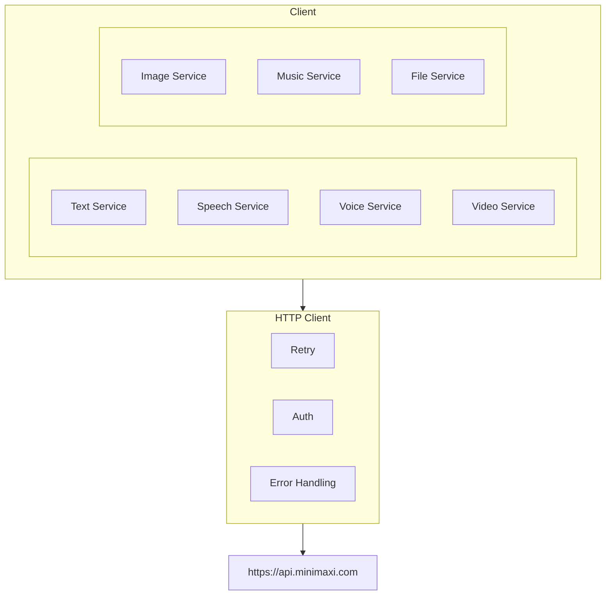
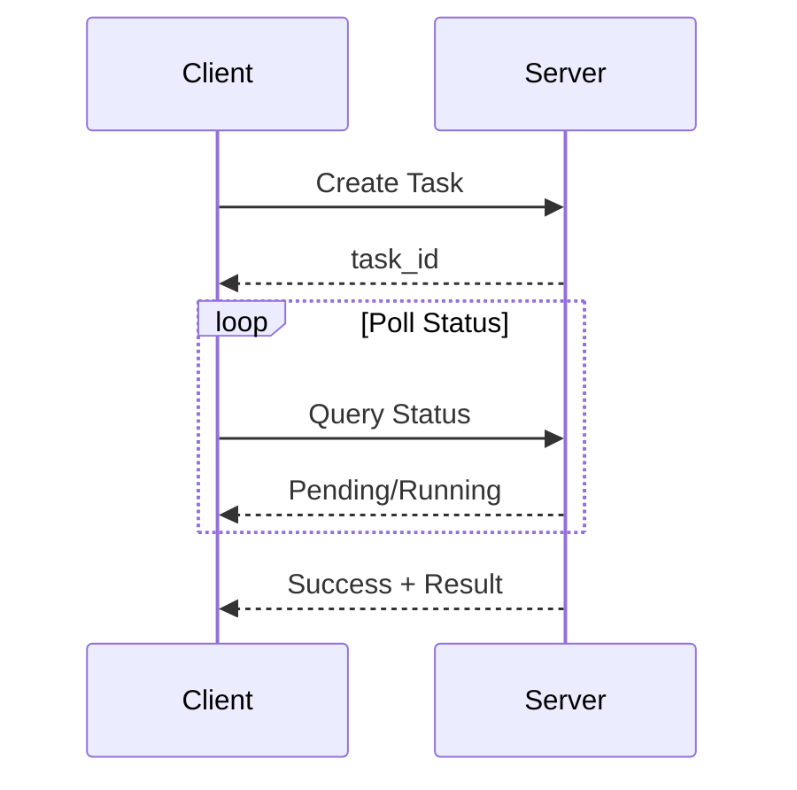

# MiniMax SDK

Go and Rust SDK for the MiniMax AI platform API.

> **Official API Documentation**: [api/README.md](./api/README.md)

## Design Goals

1. **Full API Coverage**: Support all MiniMax API capabilities
2. **Idiomatic Language Design**: Natural Go/Rust patterns
3. **Streaming Support**: First-class support for streaming responses
4. **Async Task Handling**: Convenient polling for long-running operations

## API Coverage

| API Feature | Go | Rust | Official Doc |
|-------------|:--:|:----:|--------------|
| Text Generation (Chat) | ✅ | ✅ | [api/text.md](./api/text.md) |
| Sync Speech (T2A) | ✅ | ✅ | [api/speech-t2a.md](./api/speech-t2a.md) |
| Async Speech (Long Text) | ✅ | ✅ | [api/speech-t2a-async.md](./api/speech-t2a-async.md) |
| Voice Cloning | ✅ | ✅ | [api/voice-cloning.md](./api/voice-cloning.md) |
| Voice Design | ✅ | ✅ | [api/voice-design.md](./api/voice-design.md) |
| Voice Management | ✅ | ✅ | [api/voice-management.md](./api/voice-management.md) |
| Video Generation | ✅ | ✅ | [api/video.md](./api/video.md) |
| Video Agent | ✅ | ✅ | [api/video-agent.md](./api/video-agent.md) |
| Image Generation | ✅ | ✅ | [api/image.md](./api/image.md) |
| Music Generation | ✅ | ✅ | [api/music.md](./api/music.md) |
| File Management | ✅ | ✅ | [api/file.md](./api/file.md) |

## Architecture



## Services

| Service | Description |
|---------|-------------|
| `Text` | Chat completion, streaming, tool calls |
| `Speech` | TTS sync/stream, async long-text |
| `Voice` | List voices, clone, design |
| `Video` | Text-to-video, image-to-video, agent |
| `Image` | Text-to-image, image reference |
| `Music` | Music generation from lyrics |
| `File` | Upload, list, retrieve, delete files |

## Authentication

Uses Bearer token authentication:

```
Authorization: Bearer <api_key>
```

API keys are obtained from [MiniMax Platform](https://platform.minimaxi.com).

## Base URLs

| Region | URL |
|--------|-----|
| China (Default) | `https://api.minimaxi.com` |
| Global | `https://api.minimaxi.chat` |

## Response Patterns

### Synchronous

Direct response with data.

### Streaming

SSE (Server-Sent Events) for real-time data:
- Text: Token-by-token chat responses
- Speech: Audio chunk streaming

### Async Tasks

For long-running operations (video, async speech):



## Error Handling

All errors include:
- `status_code`: Numeric error code
- `status_msg`: Human-readable message

Common error codes:
- `1000`: General error
- `1001`: Rate limit exceeded
- `1002`: Invalid parameters
- `1004`: Authentication failed

## Examples Directory

- `examples/go/minimax/` - Go SDK examples
- `examples/rust/minimax/` - Rust SDK examples
- `e2e/cmd/minimax/` - CLI test scripts

## Related

- CLI tool: `go/cmd/minimax/`
- CLI tests: `e2e/cmd/minimax/`
