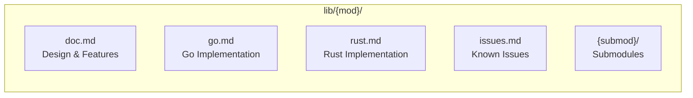
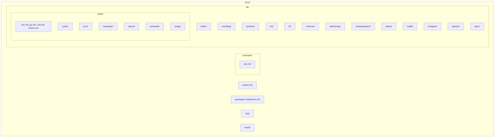
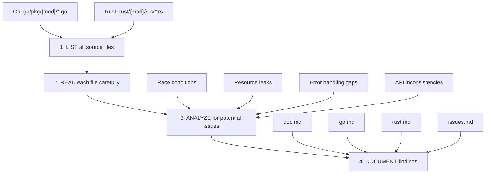

# GizToy Core Packages Documentation

This directory contains design documents, implementation notes, and known issues for all GizToy core packages.
Library docs live under `docs/lib/`.

## Documentation Structure

Each module has its own directory under `docs/lib/` with the following files:

---

## Package List

### Foundation Layer

| Package | Description | Go | Rust |
|---------|-------------|:--:|:----:|
| [buffer](./lib/buffer/doc.md) | Buffer utilities | ✅ | ✅ |
| [encoding](./lib/encoding/doc.md) | Encoding utilities (Base64, Hex) | ✅ | ✅ |
| [jsontime](./lib/jsontime/doc.md) | JSON time type serialization | ✅ | ✅ |
| [trie](./lib/trie/doc.md) | Prefix tree data structure | ✅ | ✅ |
| [cli](./lib/cli/doc.md) | CLI utilities | ✅ | ✅ |

### Audio Processing Layer

| Package | Description | Go | Rust |
|---------|-------------|:--:|:----:|
| [audio](./lib/audio/doc.md) | Audio processing framework | ✅ | ✅ |
| [audio/codec](./lib/audio/codec/doc.md) | Codecs (Opus, MP3, OGG) | ✅ | ✅ |
| [audio/pcm](./lib/audio/pcm/doc.md) | PCM processing, mixer | ✅ | ✅ |
| [audio/resampler](./lib/audio/resampler/doc.md) | Sample rate conversion (soxr) | ✅ | ✅ |
| [audio/opusrt](./lib/audio/opusrt/doc.md) | Opus realtime streaming | ✅ | ⚠️ |
| [audio/portaudio](./lib/audio/portaudio/doc.md) | Audio I/O (Go only) | ✅ | ❌ |
| [audio/songs](./lib/audio/songs/doc.md) | Built-in sound generation | ✅ | ✅ |

### API Client Layer

| Package | Description | Go | Rust |
|---------|-------------|:--:|:----:|
| [minimax](./lib/minimax/doc.md) | MiniMax API client | ✅ | ✅ |
| [dashscope](./lib/dashscope/doc.md) | DashScope Realtime API | ✅ | ✅ |
| [doubaospeech](./lib/doubaospeech/doc.md) | Doubao Speech API client | ✅ | ⚠️ |
| [jiutian](./lib/jiutian/doc.md) | Jiutian API (docs only) | ❌ | ❌ |
| [openai-realtime](./lib/openai-realtime/doc.md) | OpenAI Realtime API | ✅ | ✅ |

### Communication Layer

| Package | Description | Go | Rust |
|---------|-------------|:--:|:----:|
| [mqtt0](./lib/mqtt0/doc.md) | Lightweight MQTT client | ✅ | ✅ |
| [chatgear](./lib/chatgear/doc.md) | Device communication framework | ✅ | ✅ |
| [chatgear/transport](./lib/chatgear/transport/doc.md) | Transport layer abstraction | ✅ | ✅ |
| [chatgear/port](./lib/chatgear/port/doc.md) | Media port | ✅ | ✅ |

### AI Application Layer

| Package | Description | Go | Rust |
|---------|-------------|:--:|:----:|
| [speech](./lib/speech/doc.md) | Unified speech interface | ✅ | ✅ |
| [genx](./lib/genx/doc.md) | LLM universal interface framework | ✅ | ⚠️ |
| [genx/agent](./lib/genx/agent/doc.md) | Agent framework (Go only) | ✅ | ❌ |
| [genx/agentcfg](./lib/genx/agentcfg/doc.md) | Agent configuration system (Go only) | ✅ | ❌ |
| [genx/match](./lib/genx/match/doc.md) | Pattern matching engine (Go only) | ✅ | ❌ |

---

## Examples

- [examples](./examples/doc.md): Directory structure and how to run the samples

---

## Directory Structure

---

## Other Documentation

| Directory | Purpose |
|----------|---------|
| `esp/` | ESP32 and ESP-RS notes and comparisons |
| `bazel/` | Bazel build rules and integration notes |
| `packages-comparison.md` | Cross-language package comparison |

---

## Implementation Progress Overview

### Legend
- ✅ Fully implemented
- ⚠️ Partially implemented
- ❌ Not implemented

### Feature Comparison

| Feature | Go | Rust | Notes |
|---------|:--:|:----:|-------|
| **Foundation** |
| Block buffer | ✅ | ✅ | |
| Ring buffer | ✅ | ✅ | |
| Base64 encoding | ✅ | ✅ | |
| Hex encoding | ❌ | ✅ | Rust extra implementation |
| JSON time types | ✅ | ✅ | |
| Prefix tree | ✅ | ✅ | |
| **Audio** |
| Opus codec | ✅ | ✅ | |
| MP3 codec | ✅ | ✅ | |
| OGG container | ✅ | ✅ | |
| PCM mixer | ✅ | ✅ | |
| Sample rate conversion | ✅ | ✅ | |
| Opus realtime stream | ✅ | ⚠️ | Rust missing OGG Reader/Writer |
| Audio I/O | ✅ | ❌ | Go only (portaudio) |
| **API Clients** |
| MiniMax text/speech/video | ✅ | ✅ | |
| DashScope Realtime | ✅ | ✅ | |
| Doubao Speech TTS/ASR | ✅ | ✅ | |
| Doubao Speech TTS v2 | ✅ | ❌ | |
| Doubao Speech ASR v2 | ✅ | ❌ | |
| OpenAI Realtime | ✅ | ✅ | |
| **Communication** |
| MQTT 3.1.1 | ✅ | ✅ | |
| MQTT 5.0 | ⚠️ | ⚠️ | Partial, see Issue #32 |
| ChatGear Transport | ✅ | ✅ | |
| ChatGear MediaPort | ✅ | ✅ | |
| **AI Application** |
| Unified speech interface | ✅ | ✅ | |
| LLM Context | ✅ | ⚠️ | Rust basic implementation |
| LLM streaming | ✅ | ⚠️ | Rust basic implementation |
| Tool calling | ✅ | ⚠️ | Rust basic implementation |
| Agent framework | ✅ | ❌ | |
| Agent configuration | ✅ | ❌ | |
| Pattern matching | ✅ | ❌ | |

---

## Priority Recommendations

### P0 - Critical Missing

1. **genx/agent** (Rust): Agent framework is core functionality
2. **audio/opusrt OGG R/W** (Rust): Required for realtime audio streaming

### P1 - Feature Parity

1. **doubaospeech v2** (Rust): New API version support
2. **genx streaming/tools** (Rust): Complete base functionality

### P2 - Enhancements

1. **audio/portaudio** (Rust): Audio I/O support
2. **mqtt0 MQTT 5.0**: Complete protocol support

---

## Work Methodology

### File-by-File Review Process

For each module, the documentation is generated through a rigorous file-by-file review process:

### Issue Classification

Issues discovered during review are classified by severity:

| Severity | Description | Example |
|----------|-------------|---------|
| 🔴 **Critical** | Data loss, security vulnerability, crash | Buffer overflow, SQL injection |
| 🟠 **Major** | Incorrect behavior, resource leak | Memory leak, race condition |
| 🟡 **Minor** | Edge case bugs, poor error messages | Off-by-one, unclear panic message |
| 🔵 **Enhancement** | Missing feature, performance improvement | Missing API, unnecessary allocation |
| ⚪ **Note** | Design observation, tech debt | Code duplication, naming inconsistency |

### Review Checklist

For each source file, the following aspects are checked:

**Correctness**
- [ ] Logic errors and edge cases
- [ ] Off-by-one errors in loops/slices
- [ ] Nil/None handling
- [ ] Integer overflow/underflow

**Concurrency**
- [ ] Data races (shared mutable state)
- [ ] Deadlock potential
- [ ] Channel/mutex usage correctness
- [ ] Proper synchronization

**Resource Management**
- [ ] File/socket handle leaks
- [ ] Memory leaks (especially in FFI)
- [ ] Goroutine/task leaks
- [ ] Proper cleanup in error paths

**Error Handling**
- [ ] Ignored errors (Go: `_ = err`, Rust: `.unwrap()`)
- [ ] Error propagation correctness
- [ ] Panic vs error decision
- [ ] Context/cause preservation

**API Design**
- [ ] Go/Rust parity
- [ ] Consistent naming
- [ ] Proper visibility (pub/private)
- [ ] Documentation completeness

**Performance**
- [ ] Unnecessary allocations
- [ ] Excessive copying
- [ ] Algorithm complexity
- [ ] Buffer sizing

**Security**
- [ ] Input validation
- [ ] Injection vulnerabilities
- [ ] Credential handling
- [ ] Cryptographic correctness

---

## Related Resources

- External API documentation: `lib/minimax/api/`, `lib/dashscope/api/`, `lib/doubaospeech/api/`
- Issue tracking: `issues/`
- Example code: `examples/go/`, `examples/rust/`
