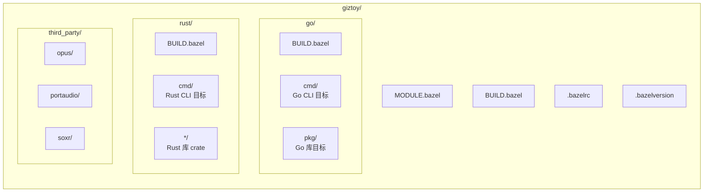

# Bazel 构建

Giztoy 使用 [Bazel](https://bazel.build) 作为跨所有语言和平台的统一构建系统。

## 为什么选择 Bazel？

1. **多语言支持**：用单一工具构建 Go、Rust、C/C++
2. **密封构建**：在不同机器上可重现的构建
3. **跨平台**：从单一代码库构建多个平台目标
4. **增量构建**：只重新构建有变化的部分

## 快速开始

### 前置条件

- [Bazelisk](https://github.com/bazelbuild/bazelisk)（推荐）或 Bazel 7.x+
- Go 1.24+（用于原生 Go 构建）
- Rust 1.80+（用于原生 Rust 构建）

### 构建命令

```bash
# 构建所有目标
bazel build //...

# 构建特定目标
bazel build //go/cmd/minimax      # Go CLI
bazel build //rust/cmd/minimax    # Rust CLI

# 运行测试
bazel test //...

# 运行二进制文件
bazel run //go/cmd/minimax -- --help
```

## 项目结构



## 使用的规则

| 语言 | 规则 |
|----------|-------|
| Go | [rules_go](https://github.com/bazelbuild/rules_go) + Gazelle |
| Rust | [rules_rust](https://github.com/bazelbuild/rules_rust) + crate_universe |
| C/C++ | 内置 `cc_library`、`cc_binary` |
| Shell | [rules_shell](https://github.com/bazelbuild/rules_shell) |

## 依赖管理

### Go 依赖

Go 依赖通过 `go/go.mod` 管理，使用 Gazelle 同步：

```bash
# 更新 Go 依赖
cd go && go mod tidy

# 重新生成 BUILD 文件
bazel run //:gazelle
```

### Rust 依赖

Rust 依赖通过 `rust/Cargo.toml` 管理，使用 crate_universe 同步：

```bash
# 更新 Cargo.lock
cd rust && cargo update

# 下次构建时 Bazel 会自动获取 crate
```

### C/C++ 依赖

第三方 C 库在 `third_party/` 中配置，使用自定义 BUILD 文件。

## 跨平台构建

### 支持的平台

| 平台 | 状态 |
|----------|--------|
| Linux（x86_64、arm64） | ✅ |
| macOS（x86_64、arm64） | ✅ |
| Android | ✅ |
| iOS | ✅ |
| HarmonyOS（鸿蒙） | ✅ |
| ESP32 | 🚧 |

### 平台特定构建

```bash
# Android
bazel build --config=android //...

# iOS
bazel build --config=ios //...
```

## 常见任务

### 添加新的 Go 包

1. 在 `go/pkg/mypackage/` 创建包
2. 运行 Gazelle 生成 BUILD 文件：
   ```bash
   bazel run //:gazelle
   ```

### 添加新的 Rust Crate

1. 在 `rust/mypackage/` 创建 crate
2. 添加到 `rust/Cargo.toml` 工作空间成员
3. 创建带有 `rust_library` 规则的 `BUILD.bazel`

### 添加 C/C++ 依赖

1. 在 `third_party/libname/` 创建配置
2. 添加带有 `cc_library` 规则的 `BUILD.bazel`
3. 从依赖目标中引用

## 常用 Targets

本节介绍项目中常用的 Bazel targets，方便日常开发使用。

### 文档服务

```bash
# 本地预览文档网站（默认端口 8000）
bazel run //pages:serve-local

# 指定端口
bazel run //pages:serve-local -- 3000

# 构建文档静态文件（输出 www.tar.gz）
bazel build //pages:www

# 部署到 GitHub Pages
bazel run //pages:deploy
```

### CLI 工具

#### Go CLI

```bash
# MiniMax CLI
bazel run //go/cmd/minimax -- --help
bazel run //go/cmd/minimax -- text chat "你好"
bazel run //go/cmd/minimax -- speech tts -t "测试语音"

# Doubao Speech CLI
bazel run //go/cmd/doubaospeech -- --help
bazel run //go/cmd/doubaospeech -- tts -t "测试语音"

# DashScope CLI
bazel run //go/cmd/dashscope -- --help

# GearTest（设备模拟测试工具）
bazel run //go/cmd/geartest -- --help
bazel run //go/cmd/geartest -- run --config config.yaml
```

#### Rust CLI

```bash
# MiniMax CLI (Rust)
bazel run //rust/cmd/minimax -- --help
bazel run //rust/cmd/minimax -- text chat "你好"

# Doubao Speech CLI (Rust)
bazel run //rust/cmd/doubaospeech -- --help

# DashScope CLI (Rust)
bazel run //rust/cmd/dashscope -- --help
```

### 示例测试脚本

示例测试脚本位于 `examples/cmd/`，用于批量测试 API 功能：

```bash
# MiniMax 示例测试
bazel run //examples/cmd/minimax:run -- go all      # 运行所有 Go 测试
bazel run //examples/cmd/minimax:run -- rust 1      # 运行 Rust 第 1 级测试
bazel run //examples/cmd/minimax:run -- both quick  # 同时测试 Go 和 Rust

# Doubao Speech 示例测试
bazel run //examples/cmd/doubaospeech:run -- tts
bazel run //examples/cmd/doubaospeech:run -- asr-stream

# DashScope 示例测试
bazel run //examples/cmd/dashscope:run -- omni-chat
```

### Go 示例程序

```bash
# 音频处理示例
bazel run //examples/go/audio/songs
bazel run //examples/go/audio/pcm/resampler
bazel run //examples/go/audio/pcm/mixer

# MiniMax 示例
bazel run //examples/go/minimax/text_chat
bazel run //examples/go/minimax/speech_tts
bazel run //examples/go/minimax/video_t2v

# Doubao Speech 示例
bazel run //examples/go/doubaospeech/tts_ws
bazel run //examples/go/doubaospeech/asr_sauc

# GenX 示例
bazel run //examples/go/genx/chat

# Speech 统一接口示例
bazel run //examples/go/speech/tts_asr
```

### Rust 示例程序

```bash
# MiniMax 示例
bazel run //examples/rust/minimax:speech
bazel run //examples/rust/minimax:text_stream

# Doubao Speech 示例
bazel run //examples/rust/doubaospeech:tts_ws

# GenX 示例
bazel run //examples/rust/genx:chat
```

### 开发辅助

```bash
# 重新生成 Go BUILD 文件
bazel run //:gazelle

# 更新 Go 依赖仓库
bazel run //:gazelle -- update-repos -from_file=go/go.mod
```

## 故障排除

### 清理构建

```bash
bazel clean --expunge
bazel build //...
```

### 依赖问题

```bash
# 刷新 Go 依赖
bazel run //:gazelle -- update-repos -from_file=go/go.mod

# 刷新 Rust 依赖
bazel clean --expunge  # crate_universe 会在下次构建时重新获取
```

## 相关

- [示例文档](../examples/doc.md)
- [GitHub Actions CI](../../.github/workflows/)
