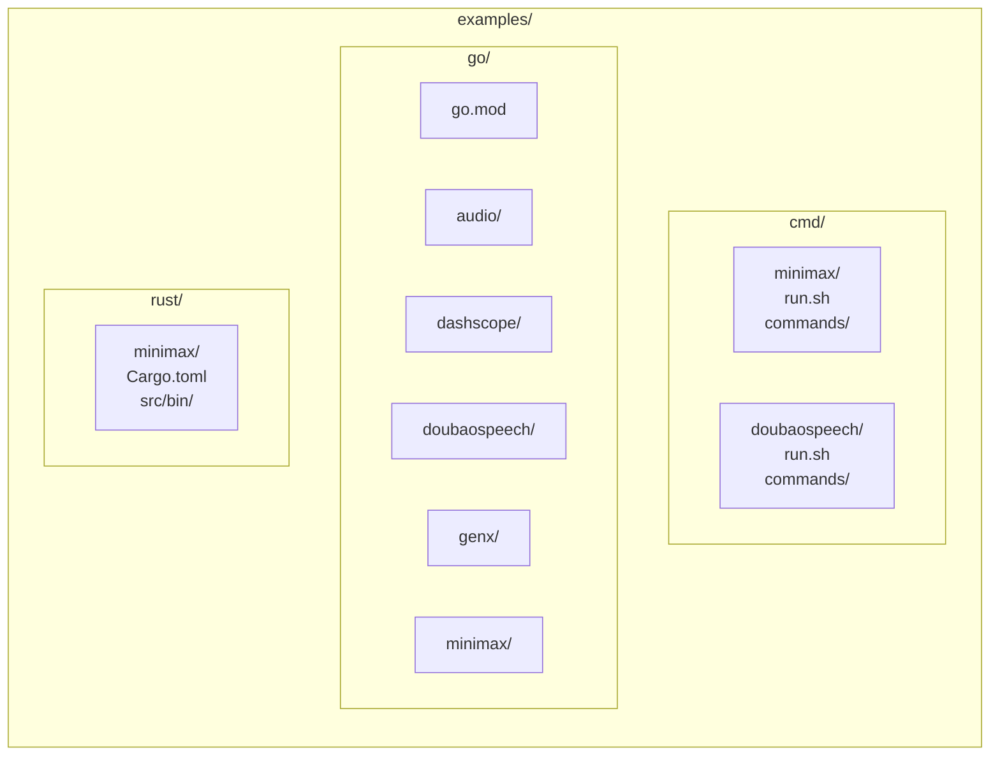

# 示例

## 概述
本文档描述了 `examples/` 目录布局以及如何运行其中包含的示例程序和 CLI 脚本。示例按语言和 SDK 分组。

## 目录布局

## 如何运行

### CLI 脚本示例
- Minimax CLI 测试运行器：
  - `./e2e/cmd/minimax/run.sh go 1`
  - Bazel：`bazel run //e2e/cmd/minimax:run -- go 1`
- 豆包语音 CLI 测试运行器：
  - `./e2e/cmd/doubaospeech/run.sh tts`
  - Bazel：`bazel run //e2e/cmd/doubaospeech:run -- tts`

### Go 示例
所有 Go 示例共享 `examples/go/go.mod` 中的一个模块，并通过 `replace` 依赖于本地 `go/` 模块。

- 构建所有 Go 示例：
  - `cd examples/go && go build ./...`

### Rust 示例
Rust 示例是独立的 crate。

- 构建 MiniMax Rust 示例：
  - `cd examples/rust/minimax && cargo build --release`

## 注意事项
- 示例二进制文件通常依赖于 API 密钥的环境变量。
- 有关配置详情，请参阅 `docs/lib/{sdk}/` 下的 SDK 文档。
