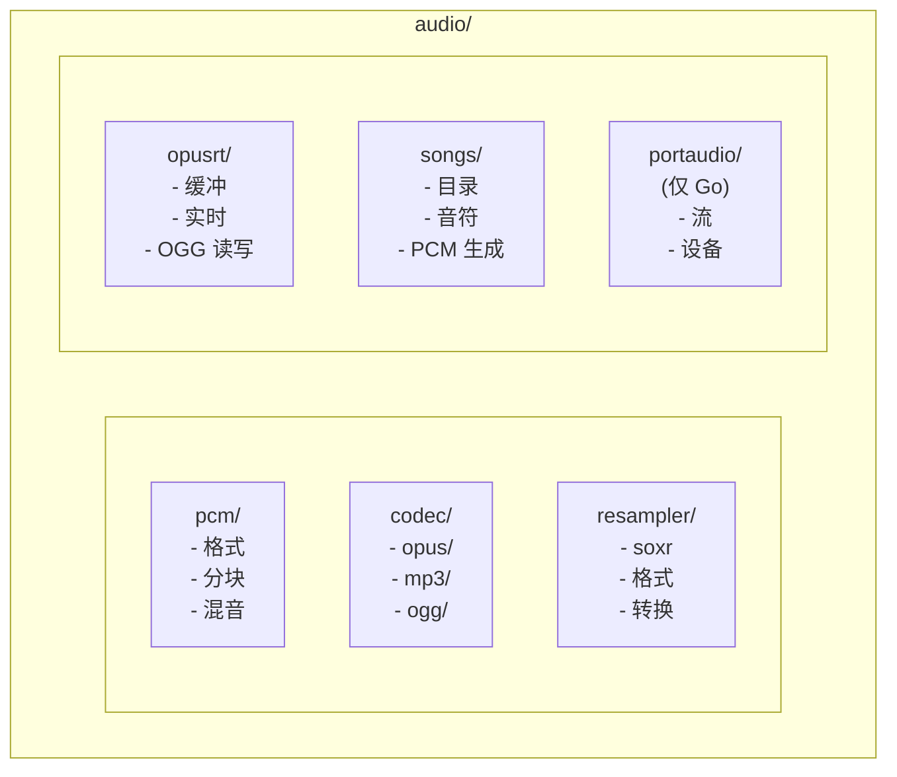

# 音频包

用于语音和多媒体应用的音频处理框架。

## 设计目标

1. **实时处理**：低延迟音频混音、编码和流传输
2. **格式灵活**：支持常见音频格式（PCM、Opus、MP3、OGG）
3. **跨平台**：提供原生库的 FFI 绑定（libopus、libsoxr、lame）
4. **流式优先**：专为连续音频流设计，而非仅针对文件

## 架构

## 子模块

| 模块 | 描述 | Go | Rust |
|--------|-------------|:--:|:----:|
| [pcm/](./pcm/doc.md) | PCM 格式、分块、混音 | ✅ | ✅ |
| [codec/](./codec/doc.md) | 音频编解码器（Opus、MP3、OGG） | ✅ | ✅ |
| [resampler/](./resampler/doc.md) | 采样率转换（soxr） | ✅ | ✅ |
| [opusrt/](./opusrt/doc.md) | 实时 Opus 流传输 | ✅ | ⚠️ |
| [songs/](./songs/doc.md) | 内置旋律 | ✅ | ✅ |
| [portaudio/](./portaudio/doc.md) | 音频 I/O 设备 | ✅ | ❌ |

## 音频格式

### PCM 格式（预定义）

| 格式 | 采样率 | 声道 | 位深 |
|--------|-------------|----------|-----------|
| `L16Mono16K` | 16000 Hz | 1 | 16 位 |
| `L16Mono24K` | 24000 Hz | 1 | 16 位 |
| `L16Mono48K` | 48000 Hz | 1 | 16 位 |

### 编解码器支持

| 编解码器 | 编码 | 解码 | 容器 |
|-------|--------|--------|-----------|
| Opus | ✅ | ✅ | Raw、OGG |
| MP3 | ✅ | ✅ | Raw |
| OGG | N/A | N/A | 仅容器 |

## 常见工作流

### 语音聊天（低延迟）

### 语音合成播放

### 音频录制

## 原生依赖

| 库 | 用途 | 构建系统 |
|---------|---------|--------------|
| libopus | Opus 编解码器 | pkg-config / Bazel |
| libsoxr | 重采样 | pkg-config / Bazel |
| lame | MP3 编码 | Bazel（内置） |
| minimp3 | MP3 解码 | Bazel（内置） |
| libogg | OGG 容器 | pkg-config / Bazel |
| portaudio | 音频 I/O | pkg-config / Bazel |

## 示例目录

- `examples/go/audio/` - Go 音频示例
- `examples/rust/audio/` - Rust 音频示例

## 相关包

- `buffer` - 用于音频数据缓冲
- `speech` - 高级语音合成/识别
- `minimax`、`doubaospeech` - 返回音频的 TTS/ASR API
