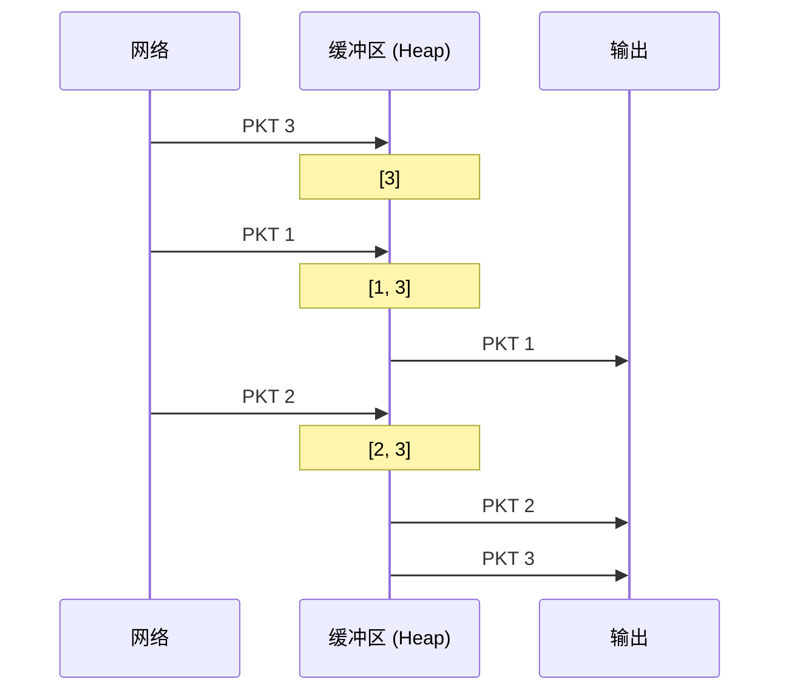
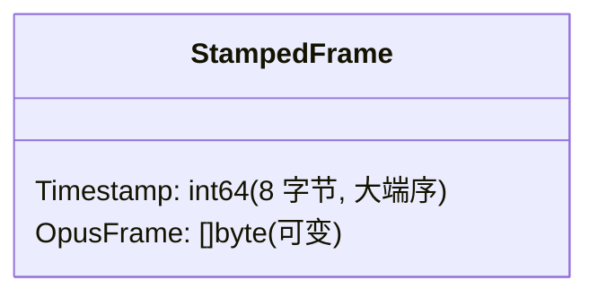
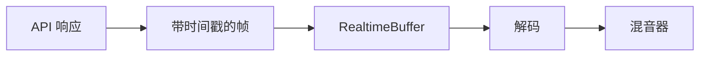
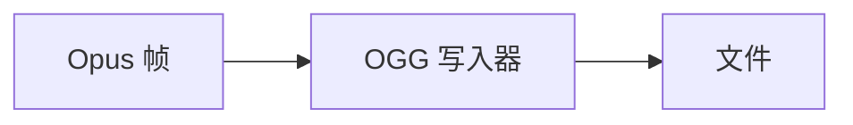

# 音频 OpusRT 模块

具有抖动缓冲和丢包处理的实时 Opus 流处理。

## 设计目标

1. **乱序处理**：重新排序乱序到达的数据包
2. **丢包检测**：检测并报告间隙以进行 PLC（丢包隐藏）
3. **实时模拟**：基于时间戳而非到达时间的播放时序
4. **OGG 容器支持**：以 OGG 格式读写 Opus（仅 Go）

## 核心概念

### 抖动缓冲

网络数据包可能乱序到达或具有可变延迟（抖动）。
抖动缓冲区收集数据包并按正确顺序输出：



### 丢包检测

连续帧时间戳之间的间隙表示丢失的数据包：

```
帧 1: 0ms - 20ms
帧 2: 20ms - 40ms    ✓ 无间隙
帧 4: 60ms - 80ms    ✗ 20ms 间隙（帧 3 丢失）
```

检测到丢包时，调用者应使用解码器 PLC：

```go
frame, loss, _ := buffer.Frame()
if loss > 0 {
    // 为 'loss' 时长生成 PLC 音频
    plcAudio := decoder.DecodePLC(...)
}
```

### 带时间戳的帧

帧使用纪元毫秒作为时间戳：



## 组件

### Buffer

带最小堆排序的简单抖动缓冲区：
- 以任意顺序追加帧
- 按时间戳顺序读取帧
- 最大时长限制（丢弃最旧的）

### RealtimeBuffer

为实时播放模拟包装 Buffer：
- 后台 goroutine 在正确时间拉取帧
- 数据不可用时生成丢失事件
- 处理时钟同步

### OGG 读写器（仅 Go）

以 OGG 容器格式读写 Opus 流：
- `OggReader`：从 OGG 文件读取 Opus 帧
- `OggWriter`：将 Opus 帧写入 OGG 容器

## 时序

### EpochMillis

所有时间戳都是自 Unix 纪元以来的毫秒数：

```go
type EpochMillis int64

// 从 time.Time 转换
stamp := EpochMillis(time.Now().UnixMilli())

// 转换为 duration
duration := stamp.Duration() // time.Duration
```

### 时间戳容差

时间戳比较有 2ms 的容差以考虑时钟漂移：

```go
const timestampEpsilon = 2 // 毫秒
```

## 使用场景

### WebRTC 音频


### 语音 API 流式传输



### 音频录制



## 示例

请参阅父级 `audio/` 文档的使用示例。

## 相关模块

- `audio/codec/opus/` - Opus 编码器/解码器
- `audio/codec/ogg/` - OGG 容器原语
- `buffer/` - RealtimeBuffer 内部使用
