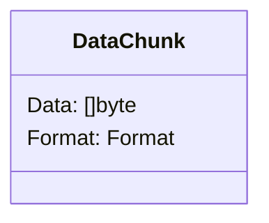
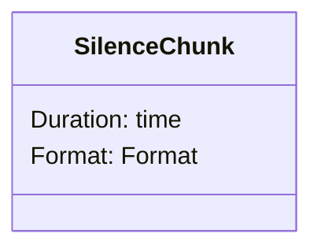
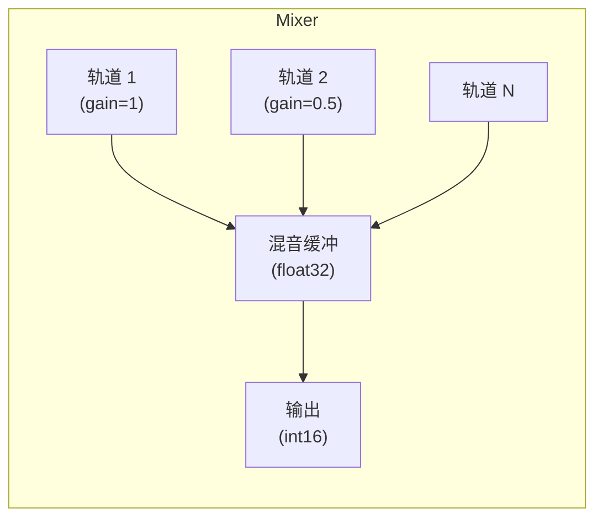

# 音频 PCM 模块

PCM（脉冲编码调制）音频格式处理、分块和多轨混音。

## 设计目标

1. **标准格式**：为常见用例提供预定义配置
2. **分块抽象**：音频数据和静音的统一接口
3. **实时混音**：带增益控制的低延迟多轨音频混音
4. **流式接口**：兼容 io.Reader/io.Writer 模式

## 预定义格式

| 格式 | 采样率 | 声道 | 位深 | 字节/秒 |
|--------|-------------|----------|-----------|-----------|
| `L16Mono16K` | 16000 Hz | 1 | 16 位 | 32,000 |
| `L16Mono24K` | 24000 Hz | 1 | 16 位 | 48,000 |
| `L16Mono48K` | 48000 Hz | 1 | 16 位 | 96,000 |

## 时长/字节计算

对于 `L16Mono16K`（16kHz，16 位单声道）：

| 时长 | 样本数 | 字节 |
|----------|---------|-------|
| 20ms | 320 | 640 |
| 50ms | 800 | 1,600 |
| 100ms | 1,600 | 3,200 |
| 1s | 16,000 | 32,000 |

公式：`字节 = 样本数 × 声道数 × (位深 / 8)`

## 分块类型

### DataChunk

带格式元数据的原始音频数据。



### SilenceChunk

生成指定时长的静音（零值），无需分配内存。



## 混音器架构

带实时混音和增益控制的多轨音频混音器：



**特性：**
- 动态轨道创建/移除
- 每轨增益控制（0.0 - 1.0+）
- 静音间隙检测
- 所有轨道完成时自动关闭
- 线程安全操作

## 混音算法

1. 将 int16 PCM 转换为 float32（-1.0 到 1.0）
2. 应用每轨增益
3. 求和所有轨道样本
4. 裁剪到 [-1.0, 1.0]
5. 转换回 int16

```
output = clip(Σ(track[i] × gain[i]), -1.0, 1.0) × 32767
```

## 使用场景

### 语音聊天混音

多个参与者的音频混合成单一输出流。

### 背景音乐

以较低增益将背景音乐轨道与语音混合。

### 音频闪避

检测到语音时降低音乐音量。

## 示例

请参阅父级 `audio/` 文档的使用示例。

## 相关模块

- `audio/codec/` - 混音前后的编码/解码
- `audio/resampler/` - 混音前转换采样率
- `buffer/` - 处理阶段之间缓冲音频数据
