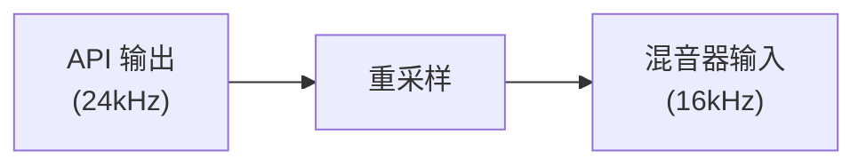
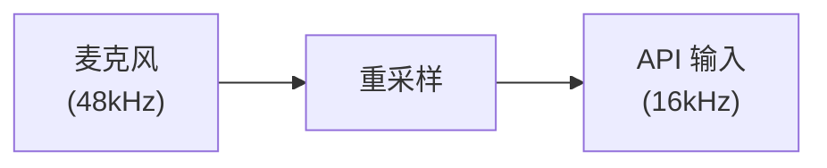
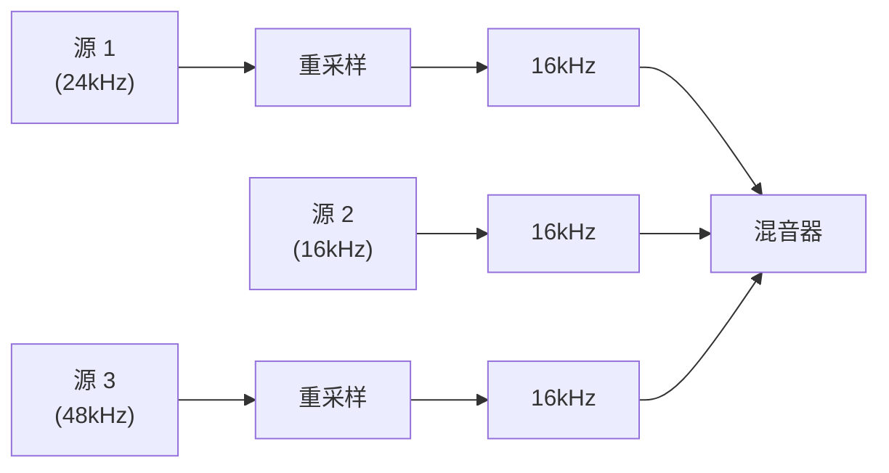

# 音频重采样模块

使用 libsoxr（SoX 重采样库）进行采样率转换。

## 设计目标

1. **高质量**：通过 libsoxr 提供专业级重采样
2. **流式处理**：将音频作为连续流处理，而非文件
3. **声道转换**：支持单声道↔立体声转换
4. **io.Reader 接口**：可直接替换音频源

## 支持的转换

### 采样率

任意整数采样率到任意其他整数采样率：
- 8000 Hz ↔ 16000 Hz ↔ 24000 Hz ↔ 48000 Hz
- 支持非标准采样率

### 声道转换

| 从 | 到 | 方法 |
|------|-----|--------|
| 单声道 | 立体声 | 复制 |
| 立体声 | 单声道 | 平均 (L+R)/2 |

## 质量级别

libsoxr 支持多个质量预设：

| 级别 | 名称 | 描述 |
|-------|------|-------------|
| 0 | Quick | 低质量，快速 |
| 1 | Low | 比 Quick 好 |
| 2 | Medium | 质量/速度平衡 |
| 3 | High | 良好质量（默认） |
| 4 | Very High | 最佳质量 |

**注意：** 当前实现默认使用 High 质量。

## 算法

libsoxr 使用多相滤波器组，可配置：
- 通带滚降
- 阻带衰减
- 线性/最小相位

High 质量预设提供：
- 通带：0-0.91 奈奎斯特
- 阻带衰减：-100 dB
- 线性相位

## 常见重采样场景

### 语音 API 到本地播放

### 本地采集到语音 API

### 多源混音

## 性能特征

每样本的近似周期数（在现代 CPU 上）：
- Quick：~10
- High：~50-100
- Very High：~200-500

对于实时 16kHz 单声道：
- 16000 样本/秒 × 100 周期 ≈ 1.6M 周期/秒
- 在现代硬件上 CPU 负载可忽略不计

## 内存使用

libsoxr 为滤波器状态维护内部缓冲区：
- 每个重采样器实例 ~10-50KB
- 更高质量设置需要更多内存

## 示例

请参阅父级 `audio/` 文档的使用示例。

## 相关模块

- `audio/pcm/` - 格式定义，与重采样器配合使用
- `audio/codec/` - 通常在编码前后进行重采样
