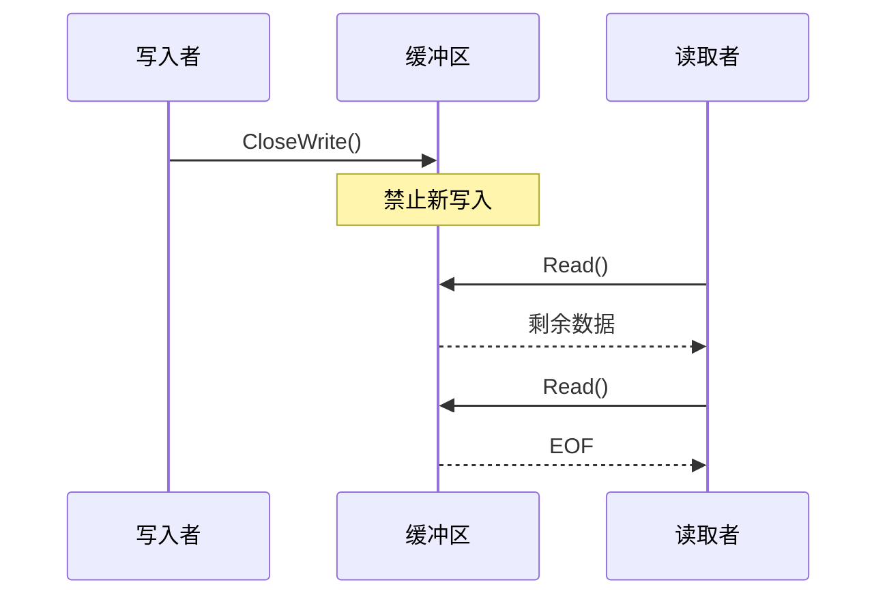
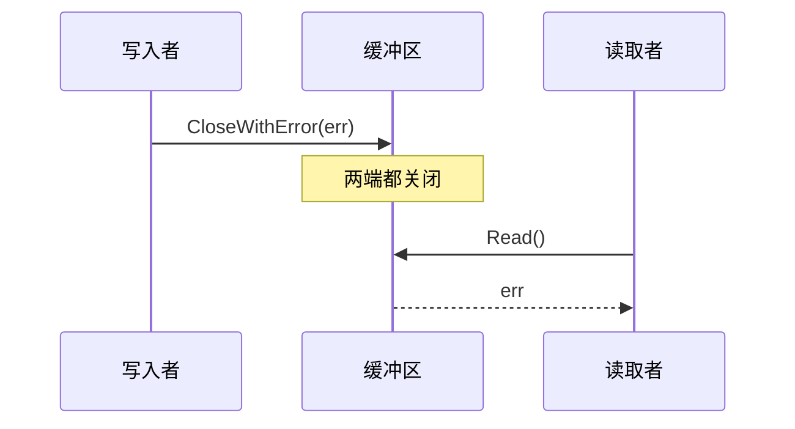

# 缓冲区包

用于生产者-消费者模式的线程安全流式缓冲区实现。

## 设计目标

1. **类型安全**：支持任意元素类型的泛型缓冲区（不限于字节）
2. **线程安全**：所有操作支持并发访问
3. **阻塞语义**：支持阻塞读/写，具有正确的关闭机制
4. **流量控制**：处理满缓冲区的不同策略

## 缓冲区类型

| 类型 | 满时行为 | 空时行为 | 使用场景 |
|------|---------------|----------------|----------|
| **Buffer** | 增长 | 阻塞 | 可变大小数据，总大小未知 |
| **BlockBuffer** | 阻塞 | 阻塞 | 流量控制，有界内存 |
| **RingBuffer** | 覆写 | 阻塞 | 滑动窗口，仅保留最新数据 |

### Buffer（可增长）

动态增长的缓冲区，写入永不阻塞。适用于：
- 数据大小事先未知
- 内存不受限制
- 写入者不应被阻塞

### BlockBuffer（固定大小，阻塞）

固定大小的循环缓冲区，读写都会阻塞。提供流量控制的背压：
- 缓冲区满时写入者阻塞
- 缓冲区空时读取者阻塞
- 可预测的内存使用

### RingBuffer（固定大小，覆写）

固定大小的循环缓冲区，满时覆写最旧数据。适用于：
- 维护最新数据的滑动窗口
- 旧样本已过时的实时数据
- 有界内存且优先保证数据新鲜度

## 通用接口

所有缓冲区类型共享一致的接口：

| 操作 | 描述 |
|-----------|-------------|
| `Write([]T)` | 写入元素切片 |
| `Read([]T)` | 读取到切片中 |
| `Add(T)` | 添加单个元素 |
| `Next()` | 读取单个元素（迭代器模式） |
| `Discard(n)` | 跳过 n 个元素不读取 |
| `Len()` | 当前元素数量 |
| `Reset()` | 清空所有数据 |
| `CloseWrite()` | 优雅关闭（允许排空） |
| `CloseWithError(err)` | 立即关闭并带错误 |
| `Close()` | 关闭两端 |
| `Error()` | 获取关闭错误（如果有） |

## 关闭语义

### CloseWrite() - 优雅关闭

### CloseWithError(err) - 立即关闭

## 示例目录

- `examples/go/buffer/` - Go 用法示例
- `examples/rust/buffer/` - Rust 用法示例

## 实现注意事项

### 内存布局

| 类型 | 布局 |
|------|--------|
| Buffer | 动态切片 → 通过 append 增长 |
| BlockBuffer | 固定循环 → 头/尾指针环绕 |
| RingBuffer | 固定循环 → 头追上尾时覆写 |

### 通知机制

- **Go**：基于通道（`writeNotify chan struct{}`）或 Cond 变量
- **Rust**：基于 Condvar（`Condvar::notify_one/all`）

### 线程安全

- **Go**：`sync.Mutex` + `sync.Cond` / 通道
- **Rust**：`Mutex<State>` + `Condvar`，封装在 `Arc` 中以支持克隆

## 相关包

- `audio/pcm` - 使用缓冲区处理 PCM 音频流
- `chatgear` - 使用缓冲区传输音频帧
- `opusrt` - 使用 RingBuffer 进行抖动缓冲
