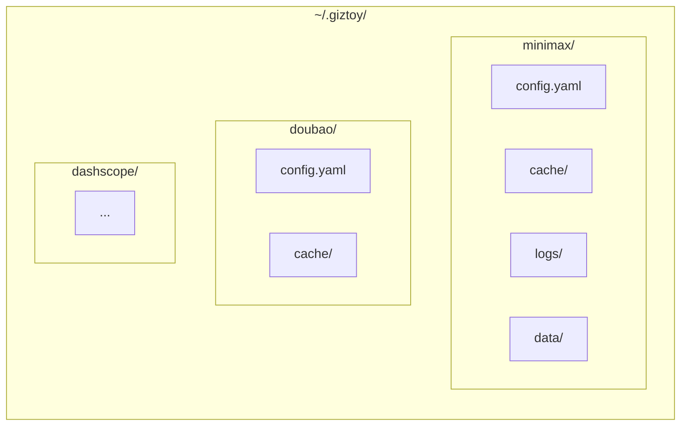

# CLI 包

Giztoy 命令行工具的通用 CLI 工具集。

## 设计目标

1. **一致的用户体验**：所有 giztoy CLI 工具共享相同模式
2. **kubectl 风格的上下文**：支持多 API 配置和上下文切换
3. **灵活的输出**：支持 JSON、YAML 和原始输出格式
4. **跨平台路径**：标准的配置/缓存/日志目录结构

## 组件

| 组件 | 描述 |
|-----------|-------------|
| **Config** | 多上下文配置管理 |
| **Output** | 输出格式化（JSON、YAML、原始） |
| **Paths** | 目录结构（~/.giztoy/<app>/） |
| **Request** | 从 YAML/JSON 文件加载请求数据 |
| **LogWriter** | 捕获日志用于 TUI 显示 |

## 目录结构



## 配置格式

```yaml
current_context: production

contexts:
  production:
    name: production
    api_key: "sk-..."
    base_url: "https://api.example.com"
    timeout: 30
    extra:
      region: "us-west"
  
  development:
    name: development
    api_key: "sk-dev-..."
    base_url: "https://dev-api.example.com"
```

## 上下文系统

类似于 kubectl，支持多个 API 上下文：

```bash
# 列出上下文
myapp config list

# 使用一个上下文
myapp config use production

# 添加一个上下文
myapp config add staging --api-key=sk-...

# 删除一个上下文
myapp config delete staging
```

## 输出格式

| 格式 | 标志 | 描述 |
|--------|------|-------------|
| YAML | `--output=yaml` | 默认，人类可读 |
| JSON | `--output=json` | 机器可读 |
| Raw | `--output=raw` | 二进制/原始数据 |

## 使用场景

### API CLI 工具

```bash
# minimax CLI
minimax chat "Hello" --context=production --output=json

# doubao CLI  
doubao tts "Hello world" --output=audio.mp3
```

### 配置管理

```bash
# 查看当前配置
myapp config show

# 设置默认语音
myapp config set default_voice "zh-CN-Standard-A"
```

## 示例目录

- `go/cmd/minimax/` - 使用此包的 MiniMax CLI
- `go/cmd/doubaospeech/` - 豆包语音 CLI
- `rust/cmd/minimax/` - Rust MiniMax CLI

## 相关包

- 项目中所有 CLI 工具都在使用
- 为 Go 和 Rust 实现提供一致的用户体验
