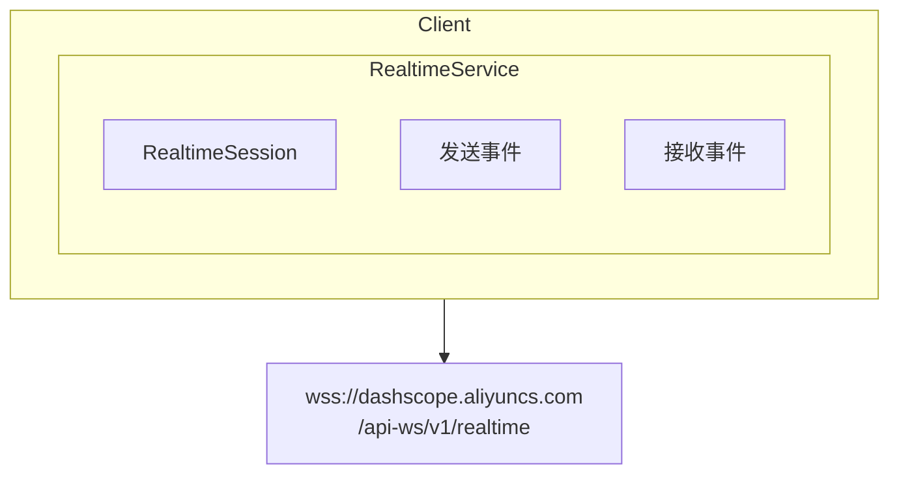
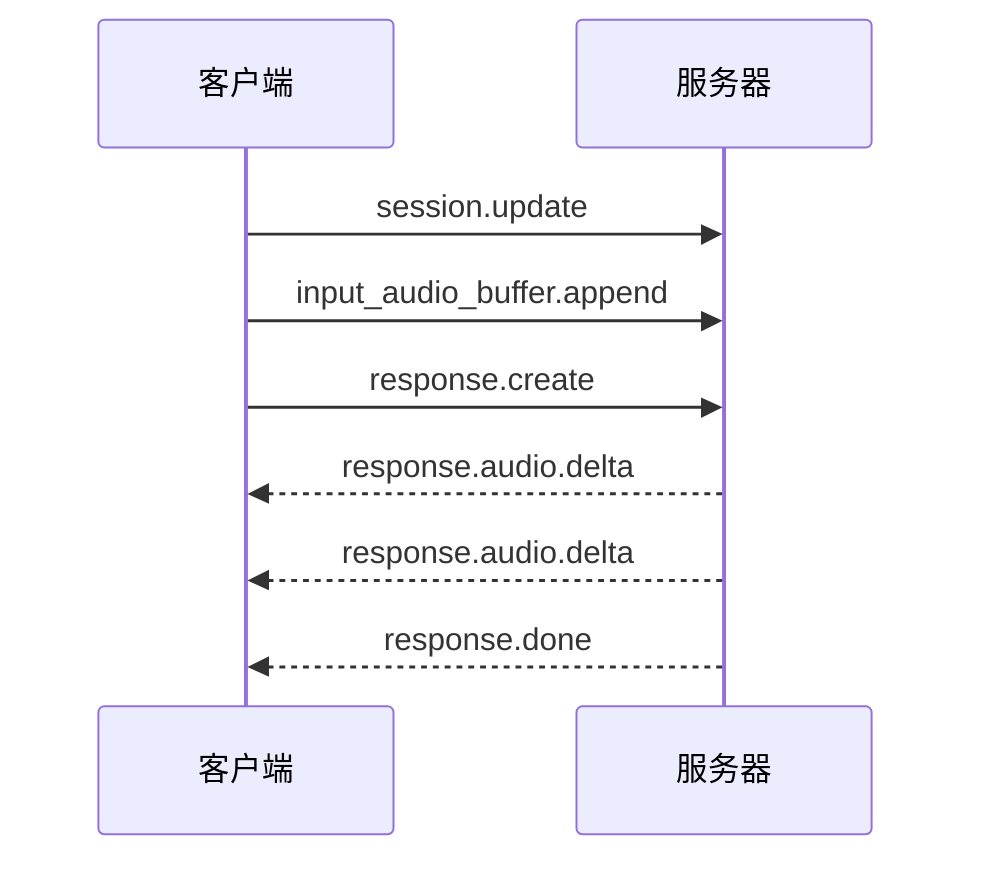

# DashScope SDK

阿里云 DashScope（百炼模型工作室）API 的 Go 和 Rust SDK。

> **官方 API 文档**：[api/README.md](./api/README.md)

## 设计目标

1. **实时优先**：主要实现 Qwen-Omni-Realtime WebSocket API
2. **OpenAI 兼容**：文本/聊天 API 使用 OpenAI 兼容 SDK
3. **原生 WebSocket**：直接 WebSocket 实现，非轮询

## 范围

本 SDK 专注于 **Qwen-Omni-Realtime** API，用于实时多模态对话。对于标准文本 API，请使用 OpenAI 兼容 SDK。

| API | SDK 覆盖 | 替代方案 |
|-----|:------------:|-------------|
| 文本聊天 | ❌ | 使用自定义 base URL 的 OpenAI SDK |
| 应用/智能体 | ❌ | 直接 HTTP 调用 |
| 实时 | ✅ | **本 SDK** |

## API 覆盖

| 功能 | Go | Rust | 官方文档 |
|---------|:--:|:----:|--------------|
| 实时会话 | ✅ | ✅ | [api/realtime/](./api/realtime/) |
| 音频输入/输出 | ✅ | ✅ | |
| 函数调用 | ✅ | ✅ | |
| 文本输入 | ✅ | ✅ | |
| 视频输入 | ⚠️ | ⚠️ | 有限支持 |

## 架构



## 认证

```
Authorization: Bearer <api_key>
```

可选的工作空间隔离：
```
X-DashScope-WorkSpace: <workspace_id>
```

## 基础 URL

| 区域 | WebSocket URL |
|--------|---------------|
| 中国（北京） | `wss://dashscope.aliyuncs.com/api-ws/v1/realtime` |
| 国际（新加坡） | `wss://dashscope-intl.aliyuncs.com/api-ws/v1/realtime` |

## 模型

| 模型 | 输入 | 输出 | 采样率 |
|-------|-------|--------|-------------|
| `qwen-omni-turbo-realtime` | 音频/文本 | 音频/文本 | 16kHz |
| `qwen3-omni-flash-realtime` | 音频/文本/视频 | 音频/文本 | 24kHz |

## 事件流



## 示例目录

- `examples/go/dashscope/` - Go SDK 示例
- `examples/cmd/dashscope/` - CLI 测试脚本

## 对于文本/聊天 API

使用 OpenAI 兼容 SDK：

**Go：**
```go
import "github.com/sashabaranov/go-openai"

config := openai.DefaultConfig(apiKey)
config.BaseURL = "https://dashscope.aliyuncs.com/compatible-mode/v1"
client := openai.NewClientWithConfig(config)
```

**Rust：**
```rust
// 使用带自定义 base URL 的 async-openai
```

## 相关

- CLI 工具：`go/cmd/dashscope/`
- CLI 测试：`examples/cmd/dashscope/`
