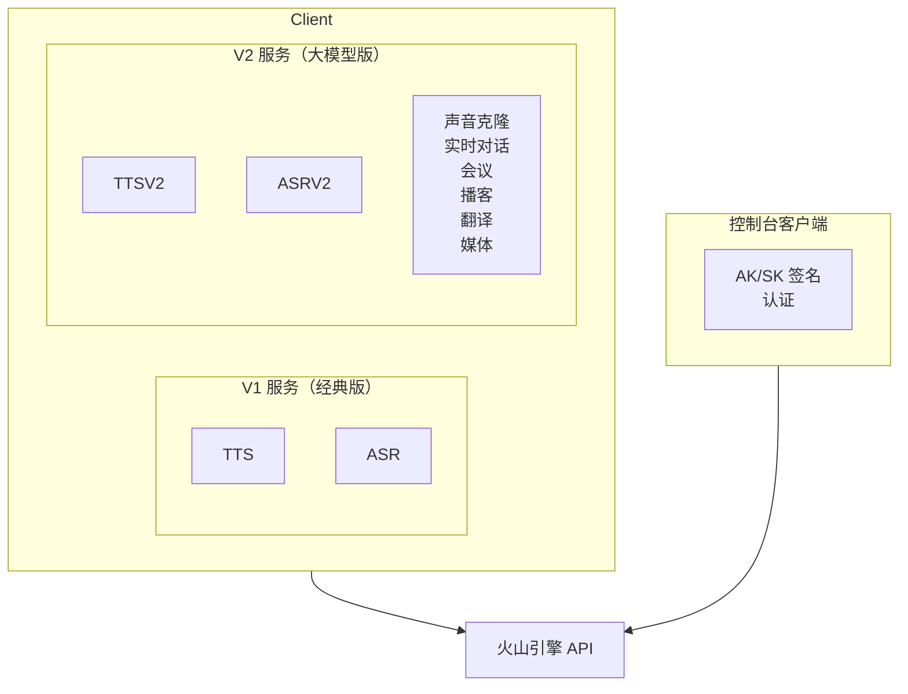

# 豆包语音 SDK

火山引擎豆包语音 API 的 Go 和 Rust SDK。

> **官方 API 文档**：[api/README.md](./api/README.md)

## 设计目标

1. **双 API 版本支持**：V1（经典）和 V2/V3（大模型）API
2. **多种认证方式**：Bearer Token、API Key、V2 API Key
3. **全面覆盖**：TTS、ASR、声音克隆、实时对话、会议、播客等
4. **流式优先**：基于 WebSocket 的流式传输，适用于实时场景

---

## 服务与 API 版本对照表

| 服务类型 | API 版本 | 端点 | Resource ID | 协议 |
|---------|---------|------|-------------|------|
| **TTS V1** | 经典版 | `POST /api/v1/tts` | cluster=`volcano_tts` | HTTP |
| **TTS V2 HTTP 流式** | 大模型 | `POST /api/v3/tts/unidirectional` | `seed-tts-1.0` / `seed-tts-2.0` | HTTP SSE |
| **TTS V2 WS 单向** | 大模型 | `WSS /api/v3/tts/unidirectional` | 同上 | WebSocket |
| **TTS V2 WS 双向** | 大模型 | `WSS /api/v3/tts/bidirection` | 同上 | WebSocket |
| **TTS V2 异步** | 大模型 | `POST /api/v3/tts/async/submit` | `seed-tts-2.0-concurr` | HTTP |
| **ASR V1** | 经典版 | `POST /api/v1/asr` | cluster=`volcengine_*` | HTTP |
| **ASR V2 流式** | 大模型 | `WSS /api/v3/sauc/bigmodel` | `volc.bigasr.sauc.duration` | WebSocket |
| **ASR V2 文件** | 大模型 | `POST /api/v3/auc/submit` | `volc.bigasr.auc.duration` | HTTP |
| **Podcast HTTP** | V1 | `POST /api/v1/podcast/submit` | N/A | HTTP |
| **SAMI Podcast WS** | V3 | `WSS /api/v3/sami/podcasttts` | `volc.service_type.10050` | WebSocket |
| **Realtime 实时对话** | V3 | `WSS /api/v3/realtime/dialogue` | `volc.speech.dialog` | WebSocket |
| **声音复刻** | V3 | 见控制台 API | `seed-icl-1.0` / `seed-icl-2.0` | HTTP |
| **同声传译** | V3 | `WSS /api/v3/simt/*` | `volc.megatts.simt` | WebSocket |

---

## Resource ID 完整对照表

### TTS 服务

| Resource ID | 别名 | 说明 | 适用音色后缀 |
|-------------|------|------|-------------|
| `seed-tts-1.0` | `volc.service_type.10029` | TTS 大模型 1.0 字符版 | `_moon_bigtts` |
| `seed-tts-1.0-concurr` | `volc.service_type.10048` | TTS 大模型 1.0 并发版 | `_moon_bigtts` |
| `seed-tts-2.0` | - | TTS 大模型 2.0 字符版 | `_uranus_bigtts` |
| `seed-tts-2.0-concurr` | - | TTS 大模型 2.0 并发版 | `_uranus_bigtts` |
| `seed-icl-1.0` | - | 声音复刻 1.0 字符版 | 复刻音色 |
| `seed-icl-2.0` | - | 声音复刻 2.0 字符版 | `_saturn_bigtts` |

### ASR 服务

| Resource ID | 说明 |
|-------------|------|
| `volc.bigasr.sauc.duration` | 大模型流式 ASR（时长计费）|
| `volc.bigasr.auc.duration` | 大模型录音文件识别（时长计费）|

### 其他服务

| Resource ID | 说明 |
|-------------|------|
| `volc.speech.dialog` | 端到端实时语音大模型 |
| `volc.service_type.10050` | SAMI Podcast 播客合成 |
| `volc.megatts.podcast` | Podcast（另一个 ID）|
| `volc.megatts.simt` | 同声传译 |

---

## 音色命名规则（重要！）

> ⚠️ **关键问题**：音色后缀与 Resource ID 的对应关系在官方文档中没有明确说明，以下规则通过实测得出。

| 音色后缀 | 适用 Resource ID | 示例音色 | 说明 |
|---------|-----------------|---------|------|
| 无后缀 | V1 `cluster=volcano_tts` | `zh_female_cancan` | TTS 1.0 经典音色 |
| `_moon_bigtts` | `seed-tts-1.0` | `zh_female_shuangkuaisisi_moon_bigtts` | TTS 1.0 大模型音色 |
| `_uranus_bigtts` | `seed-tts-2.0` | `zh_female_xiaohe_uranus_bigtts` | TTS 2.0 大模型音色 ✅ |
| `_mars_bigtts` | 未确认 | `zh_female_cancan_mars_bigtts` | 可能需要特定权限 |
| `_saturn_bigtts` | `seed-icl-*` 或 Podcast | `zh_female_xxx_saturn_bigtts` | 声音复刻 / Podcast 专用 |
| `_v2_saturn_bigtts` | `volc.service_type.10050` | `zh_male_dayixiansheng_v2_saturn_bigtts` | SAMI Podcast 专用 |

### 常见错误

```json
{"code": 55000000, "message": "resource ID is mismatched with speaker related resource"}
```

**含义**：Resource ID 和音色不匹配（不是"没开通"），请检查音色后缀是否与 Resource ID 对应。

### 已验证可用的组合

| Resource ID | 可用音色 |
|-------------|---------|
| `seed-tts-2.0` | `zh_female_xiaohe_uranus_bigtts` ✅ |
| `seed-tts-2.0` | `zh_female_vv_uranus_bigtts` ✅ |
| `seed-tts-2.0` | `zh_male_taocheng_uranus_bigtts` ✅ |
| `seed-tts-1.0` | `zh_female_shuangkuaisisi_moon_bigtts` ✅ |
| `volc.service_type.10050` | `zh_male_dayixiansheng_v2_saturn_bigtts` ✅ |
| `volc.service_type.10050` | `zh_female_mizaitongxue_v2_saturn_bigtts` ✅ |

---

## 认证方式对照表

### V1 API（经典版）

| Header | 值 | 说明 |
|--------|---|------|
| `Authorization` | `Bearer {token}` | Bearer Token 认证 |

### V2/V3 API（大模型版）

| Header | 值 | 说明 |
|--------|---|------|
| `X-Api-App-Id` | `{app_id}` | 应用 ID |
| `X-Api-Access-Key` | `{token}` | Access Token |
| `X-Api-Resource-Id` | `{resource_id}` | 资源 ID |

### 特殊服务（需要固定 App-Key）

| 服务 | 额外 Header | 固定值 |
|------|------------|--------|
| SAMI Podcast | `X-Api-App-Key` | `aGjiRDfUWi` |
| Realtime | `X-Api-App-Key` | `BYsHlwdHqc` |

### Console API

使用火山引擎 OpenAPI AK/SK 签名（HMAC-SHA256），与语音 API 认证方式不同。

---

## CLI 命令结构（方案 A）

```
doubaospeech
├── tts
│   ├── v1
│   │   ├── synthesize          # TTS V1 同步合成
│   │   └── stream              # TTS V1 流式合成
│   └── v2
│       ├── stream              # TTS V2 HTTP 流式
│       ├── ws                  # TTS V2 WebSocket 单向
│       ├── bidirectional       # TTS V2 WebSocket 双向
│       └── async               # TTS V2 异步长文本
├── asr
│   ├── v1
│   │   ├── recognize           # ASR V1 一句话识别
│   │   └── stream              # ASR V1 流式识别
│   └── v2
│       ├── stream              # ASR V2 流式识别
│       └── file                # ASR V2 文件识别
├── podcast
│   ├── http                    # Podcast HTTP 提交
│   └── sami                    # SAMI Podcast WebSocket
├── realtime
│   └── interactive             # 实时语音对话
├── voice
│   ├── list                    # 列出音色
│   ├── clone                   # 声音复刻
│   └── status                  # 查询状态
└── config
    ├── init                    # 初始化配置
    ├── view                    # 查看配置
    └── set                     # 设置配置
```

### 命令示例

```bash
# TTS V2 HTTP 流式（推荐）
doubaospeech tts v2 stream -f tts.yaml -o output.mp3

# TTS V2 WebSocket 双向
doubaospeech tts v2 bidirectional -f tts.yaml -o output.mp3

# TTS V1（旧版，不推荐）
doubaospeech tts v1 synthesize -f tts.yaml -o output.mp3

# ASR V2 流式
doubaospeech asr v2 stream -f asr.yaml

# SAMI Podcast
doubaospeech podcast sami -f podcast.yaml -o output.mp3
```

### 请求文件示例

**TTS V2 请求 (tts.yaml)**:
```yaml
text: "你好，这是一段测试语音。"
speaker: zh_female_xiaohe_uranus_bigtts  # 注意音色后缀！
resource_id: seed-tts-2.0                 # 必须与音色匹配！
format: mp3
sample_rate: 24000
```

---

## 架构



## API 覆盖

| 功能 | V1（经典版） | V2（大模型版） | Go | Rust |
|---------|:------------:|:-------------:|:--:|:----:|
| TTS 同步 | ✅ | ✅ | ✅ | ✅ |
| TTS 流式 | ✅ | ✅ | ✅ | ✅ |
| TTS 异步（长文本） | ✅ | ✅ | ⚠️ | ⚠️ |
| TTS WS 双向 | N/A | ✅ | ✅ | ✅ |
| ASR 一句话 | ✅ | ✅ | ✅ | ✅ |
| ASR 流式 | ✅ | ✅ | ✅ | ✅ |
| ASR 文件 | ✅ | ✅ | ✅ | ✅ |
| 声音克隆 | N/A | ✅ | ✅ | ✅ |
| 实时对话 | N/A | ✅ | ✅ | ✅ |
| 会议转写 | N/A | ✅ | ✅ | ✅ |
| 播客合成 | N/A | ✅ | ✅ | ✅ |
| 同传翻译（SIMT） | N/A | ✅ | ✅ | ✅ |
| 媒体字幕 | N/A | ✅ | ✅ | ✅ |
| 控制台 API | N/A | ✅ | ✅ | ✅ |

> ⚠️ TTS 异步（长文本）在 Go 和 Rust CLI 中有命令但 SDK 实现尚未完成

---

## 示例目录

- `examples/go/doubaospeech/` - Go SDK 示例
- `e2e/cmd/doubaospeech/` - CLI 测试脚本

## 相关

- Go CLI 工具：`go/cmd/doubaospeech/`
- Rust CLI 工具：`rust/cmd/doubaospeech/`
- CLI 测试脚本：`e2e/cmd/doubaospeech/`
- AI 开发指南（Go）：`go/pkg/doubaospeech/AGENTS.md`
