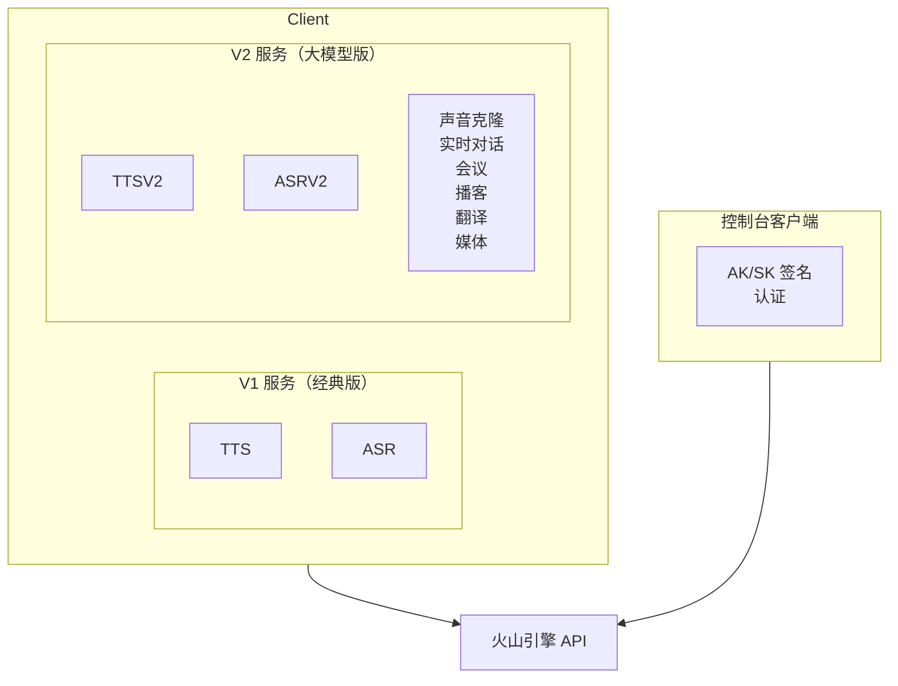

# 豆包语音 SDK

火山引擎豆包语音 API 的 Go 和 Rust SDK。

> **官方 API 文档**：[api/README.md](./api/README.md)

## 设计目标

1. **双 API 版本支持**：V1（经典）和 V2/V3（大模型）API
2. **多种认证方式**：Bearer Token、API Key、V2 API Key
3. **全面覆盖**：TTS、ASR、声音克隆、实时对话、会议、播客等
4. **流式优先**：基于 WebSocket 的流式传输，适用于实时场景

## API 版本

豆包语音有两代 API：

| 版本 | 名称 | 功能 | 推荐 |
|---------|------|----------|-------------|
| V1 | 经典版 | 基础 TTS/ASR | 旧项目 |
| V2/V3 | 大模型版 | 高级 TTS/ASR、实时对话 | ✅ 新项目 |

## API 覆盖

| 功能 | V1（经典版） | V2（大模型版） | Go | Rust |
|---------|:------------:|:-------------:|:--:|:----:|
| TTS 同步 | ✅ | ✅ | ✅ | ✅ |
| TTS 流式 | ✅ | ✅ | ✅ | ✅ |
| TTS 异步（长文本） | ✅ | ✅ | ✅ | ⚠️ |
| ASR 一句话 | ✅ | ✅ | ✅ | ✅ |
| ASR 流式 | ✅ | ✅ | ✅ | ✅ |
| ASR 文件 | ✅ | ✅ | ✅ | ⚠️ |
| 声音克隆 | N/A | ✅ | ✅ | ✅ |
| 实时对话 | N/A | ✅ | ✅ | ✅ |
| 会议转写 | N/A | ✅ | ✅ | ✅ |
| 播客合成 | N/A | ✅ | ✅ | ✅ |
| 同传翻译（SIMT） | N/A | ✅ | ✅ | ✅ |
| 媒体字幕 | N/A | ✅ | ✅ | ✅ |
| 控制台 API | N/A | ✅ | ✅ | ✅ |

## 架构

## 认证方式

### 语音 API 客户端

| 方式 | 请求头 | 使用场景 |
|--------|--------|----------|
| API Key | `x-api-key: {key}` | 最简单，推荐 |
| Bearer Token | `Authorization: Bearer;{token}` | V1 API |
| V2 API Key | `X-Api-Access-Key`、`X-Api-App-Key` | V2/V3 API |

### 控制台客户端

使用火山引擎 OpenAPI AK/SK 签名（HMAC-SHA256）。

## 资源 ID（V2/V3）

| 服务 | 资源 ID |
|---------|-------------|
| TTS 2.0 | `seed-tts-2.0` |
| TTS 2.0 并发 | `seed-tts-2.0-concurr` |
| ASR 流式 | `volc.bigasr.sauc.duration` |
| ASR 文件 | `volc.bigasr.auc.duration` |
| 实时对话 | `volc.speech.dialog` |
| 播客 | `volc.service_type.10050` |
| 翻译 | `volc.megatts.simt` |
| 声音克隆 | `seed-icl-2.0` |

## 集群（V1）

| 集群 | 服务 |
|---------|---------|
| `volcano_tts` | TTS 标准版 |
| `volcano_mega` | TTS 大模型版 |
| `volcano_icl` | 声音克隆 |
| `volcengine_streaming_common` | ASR 流式 |

## 示例目录

- `examples/go/doubaospeech/` - Go SDK 示例
- `examples/cmd/doubaospeech/` - CLI 测试脚本

## 相关

- CLI 工具：`go/cmd/doubaospeech/`
- CLI 测试：`examples/cmd/doubaospeech/`
