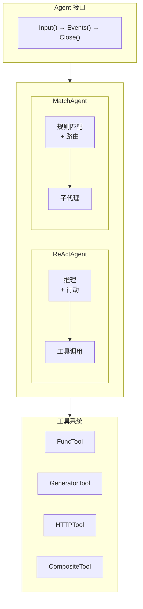
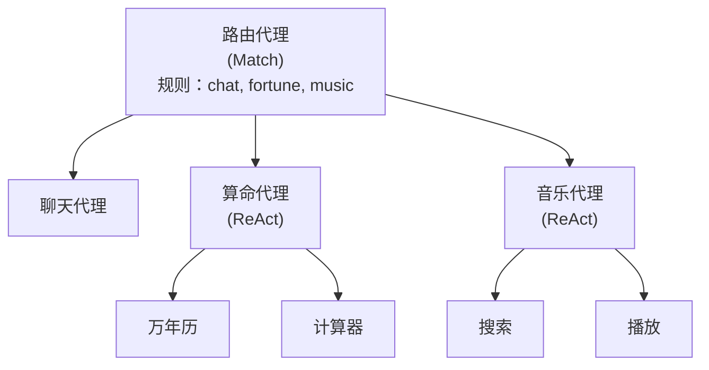

# GenX Agent 框架

构建 LLM 驱动的自主代理框架。

> **注意：** 此包仅支持 Go。没有 Rust 实现。

## 设计目标

1. **灵活的代理架构**：支持多种代理模式
2. **基于事件的 API**：对代理执行的细粒度控制
3. **工具编排**：丰富的代理工具生态系统
4. **多技能助手**：用于复杂工作流的路由代理

## 代理类型

### ReActAgent

实现推理和行动（ReAct）模式：
- 逐步思考用户请求
- 选择并执行工具来完成任务
- 迭代推理直到任务完成

### MatchAgent

实现基于意图的路由：
- 将用户输入与预定义规则匹配
- 路由到适当的子代理或操作
- 适用于构建多技能助手

## 架构



## 事件系统

代理通过事件进行通信：

| 事件 | 描述 |
|-------|-------------|
| `EventChunk` | 输出文本块 |
| `EventEOF` | 轮次结束，等待输入 |
| `EventClosed` | 代理完成（调用了退出工具） |
| `EventToolStart` | 工具执行开始 |
| `EventToolDone` | 工具成功完成 |
| `EventToolError` | 工具执行失败 |
| `EventInterrupted` | 代理被中断 |

## 工具类型

| 工具 | 描述 |
|------|-------------|
| `BuiltinTool` | 包装 Go 函数 |
| `GeneratorTool` | 基于 LLM 的生成 |
| `HTTPTool` | 带 jq 提取的 HTTP 请求 |
| `CompositeTool` | 顺序工具管道 |
| `TextProcessorTool` | 文本处理 |

## 退出工具

工具可以发出代理完成信号：

```yaml
tools:
  - $ref: tool:goodbye
    quit: true
```

执行时，代理完成并返回 `EventClosed`。

## 多技能助手模式



## 相关

- 配置：[../agentcfg/](../agentcfg/)
- 模式匹配：[../match/](../match/)
