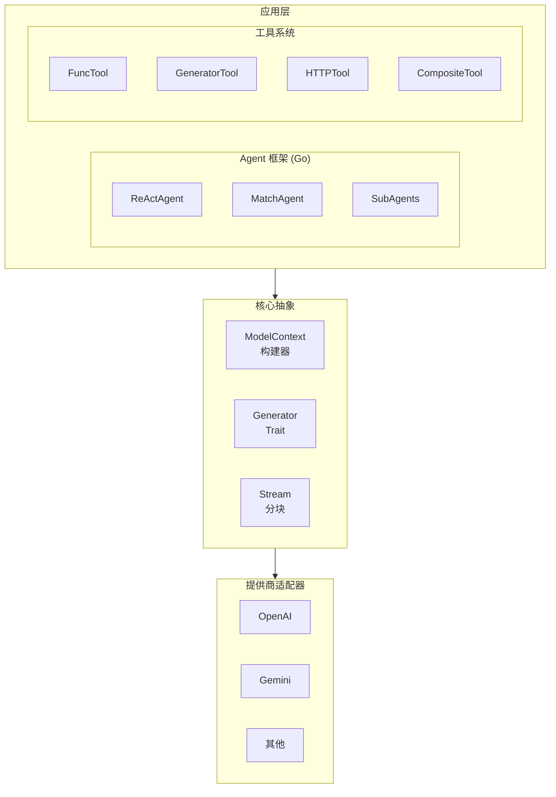

# GenX - 通用 LLM 接口

GenX 是大语言模型（LLM）的通用抽象层。

## 设计目标

1. **提供商无关**：单一 API 适用于 OpenAI、Gemini 等提供商
2. **流式优先**：原生支持流式响应
3. **工具编排**：丰富的函数调用和工具管理
4. **Agent 框架**：构建自主 AI 代理（仅 Go）

## 架构



## 核心概念

### ModelContext

包含 LLM 生成的所有输入：
- **Prompts**：系统指令（命名提示词）
- **Messages**：对话历史
- **Tools**：可用函数定义
- **Params**：模型参数（temperature、max_tokens 等）
- **CoTs**：思维链示例

### Generator

LLM 提供商接口：
- `GenerateStream()`：流式文本生成
- `Invoke()`：结构化函数调用

### Stream

流式响应处理器：
- `Next()`：获取下一个消息块
- `Close()`：关闭流
- `CloseWithError()`：带错误关闭

### 消息类型

| 类型 | 描述 |
|------|-------------|
| `user` | 用户输入 |
| `assistant` | 模型响应 |
| `system` | 系统提示（在消息中） |
| `tool` | 工具调用/结果 |

### 内容类型

| 类型 | 描述 |
|------|-------------|
| `Text` | 纯文本 |
| `Blob` | 二进制数据（图像、音频） |
| `ToolCall` | 函数调用请求 |
| `ToolResult` | 函数调用响应 |

## Agent 框架（仅 Go）

### Agent 类型

| Agent | 描述 |
|-------|-------------|
| `ReActAgent` | 推理 + 行动模式 |
| `MatchAgent` | 基于意图的路由 |

### 工具类型

| 工具 | 描述 |
|------|-------------|
| `FuncTool` | Go 函数包装器 |
| `GeneratorTool` | 基于 LLM 的生成 |
| `HTTPTool` | HTTP 请求 |
| `CompositeTool` | 工具管道 |
| `TextProcessorTool` | 文本处理 |

### 事件系统

Agent 发出事件以进行细粒度控制：
- `EventChunk`：输出块
- `EventEOF`：轮次结束
- `EventClosed`：Agent 完成
- `EventToolStart`：工具执行开始
- `EventToolDone`：工具完成
- `EventToolError`：工具失败
- `EventInterrupted`：被中断

## 配置（agentcfg）

Agent 和工具的 YAML/JSON 配置：

```yaml
type: react
name: assistant
prompt: |
  你是一个有帮助的助手。
generator:
  model: gpt-4
tools:
  - $ref: tool:search
  - $ref: tool:calculator
```

支持 `$ref` 引用可复用组件。

## 提供商支持

| 提供商 | Go | Rust |
|----------|:--:|:----:|
| OpenAI | ✅ | ✅ |
| Gemini | ✅ | ✅ |
| 兼容 API | ✅ | ✅ |

## 示例目录

- `examples/go/genx/` - Go 示例
- `examples/rust/genx/` - Rust 示例
