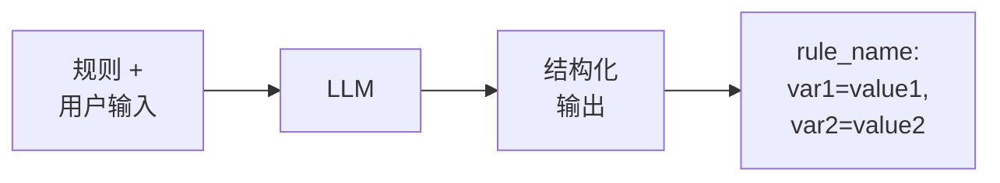
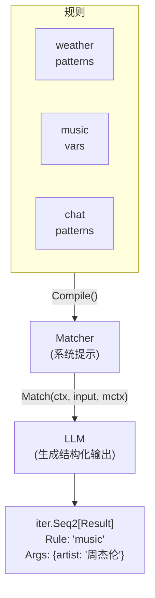

# GenX Match - 模式匹配引擎

基于 LLM 的意图识别和模式匹配。

> **注意：** 此包仅支持 Go。没有 Rust 实现。

## 设计目标

1. **意图识别**：将用户输入匹配到预定义意图
2. **变量提取**：从自然语言中提取结构化数据
3. **流式输出**：在匹配到达时处理
4. **LLM 驱动**：使用 LLM 进行灵活匹配

## 工作原理



1. **编译**：规则被编译成系统提示
2. **匹配**：用户输入与提示一起发送到 LLM
3. **解析**：输出行被解析为结构化 Results

## 规则定义

### 基本规则

```yaml
name: weather
patterns:
  - 查天气
  - 今天天气怎么样
  - 明天下雨吗
```

### 带变量的规则

```yaml
name: music
vars:
  title:
    label: 歌曲名
    type: string
  artist:
    label: 歌手
    type: string
patterns:
  - 播放歌曲
  - 我想听歌
  - ["我想听[title]", "title=[歌曲名]"]
  - ["我想听[artist]的歌", "artist=[歌手]"]
  - ["我想听[artist]的[title]", "artist=[歌手], title=[歌曲名]"]
```

### 模式格式

| 格式 | 描述 | 示例 |
|--------|-------------|---------|
| 字符串 | 简单模式，无变量 | `"播放歌曲"` |
| 数组 `[input, output]` | 带预期输出的模式 | `["我想听[title]", "title=[歌曲名]"]` |

## 输出格式

LLM 每个匹配输出一行：

```
rule_name: var1=value1, var2=value2
```

示例：
- `weather`（无变量）
- `music: artist=周杰伦`（一个变量）
- `music: artist=周杰伦, title=稻香`（多个变量）

## 变量类型

| 类型 | 描述 | 解析 |
|------|-------------|---------|
| `string` | 文本（默认） | 原样 |
| `int` | 整数 | `strconv.ParseInt` |
| `float` | 浮点数 | `strconv.ParseFloat` |
| `bool` | 布尔值 | `strconv.ParseBool` |

## 架构



## 与 MatchAgent 集成

match 包被 MatchAgent 用于意图路由：

```yaml
# MatchAgent 配置
type: match
name: router
rules:
  - $ref: rule:weather
  - $ref: rule:music
route:
  - rules: [weather]
    agent: $ref: agent:weather_assistant
  - rules: [music]
    agent: $ref: agent:music_player
```

## 相关

- Agent 框架：[../agent/](../agent/)
- 配置：[../agentcfg/](../agentcfg/)
