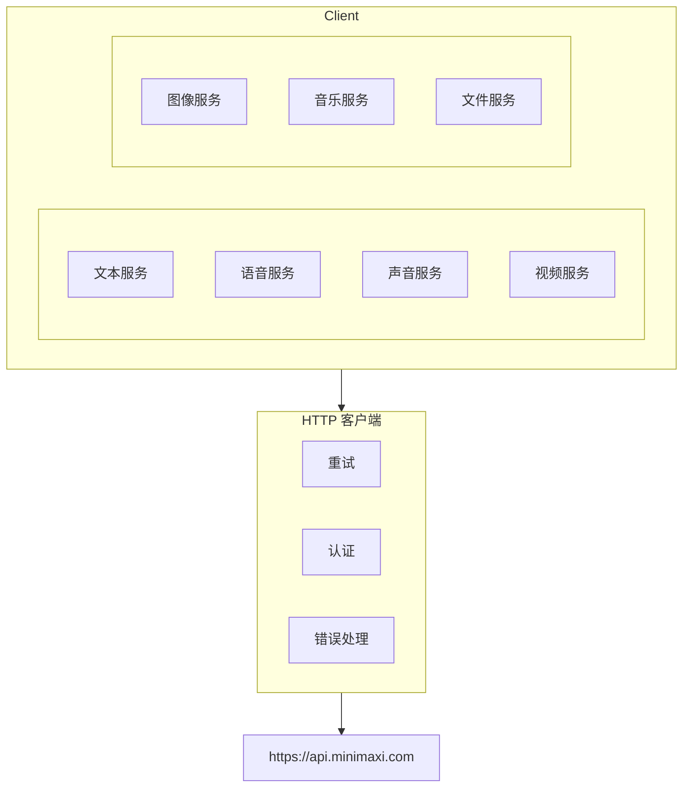
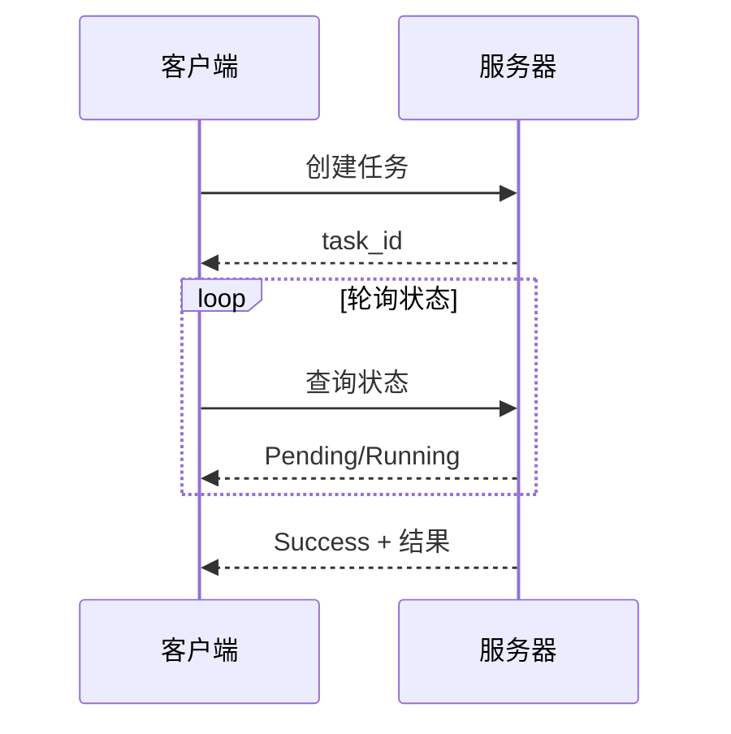

# MiniMax SDK

MiniMax AI 平台 API 的 Go 和 Rust SDK。

> **官方 API 文档**：[api/README.md](./api/README.md)

## 设计目标

1. **完整 API 覆盖**：支持所有 MiniMax API 功能
2. **地道的语言设计**：自然的 Go/Rust 模式
3. **流式支持**：一流的流式响应支持
4. **异步任务处理**：便捷的长时间操作轮询

## API 覆盖

| API 功能 | Go | Rust | 官方文档 |
|-------------|:--:|:----:|--------------|
| 文本生成（聊天） | ✅ | ✅ | [api/text.md](./api/text.md) |
| 同步语音（T2A） | ✅ | ✅ | [api/speech-t2a.md](./api/speech-t2a.md) |
| 异步语音（长文本） | ✅ | ✅ | [api/speech-t2a-async.md](./api/speech-t2a-async.md) |
| 声音克隆 | ✅ | ✅ | [api/voice-cloning.md](./api/voice-cloning.md) |
| 声音设计 | ✅ | ✅ | [api/voice-design.md](./api/voice-design.md) |
| 声音管理 | ✅ | ✅ | [api/voice-management.md](./api/voice-management.md) |
| 视频生成 | ✅ | ✅ | [api/video.md](./api/video.md) |
| 视频 Agent | ✅ | ✅ | [api/video-agent.md](./api/video-agent.md) |
| 图像生成 | ✅ | ✅ | [api/image.md](./api/image.md) |
| 音乐生成 | ✅ | ✅ | [api/music.md](./api/music.md) |
| 文件管理 | ✅ | ✅ | [api/file.md](./api/file.md) |

## 架构



## 服务

| 服务 | 描述 |
|---------|-------------|
| `Text` | 聊天补全、流式、工具调用 |
| `Speech` | TTS 同步/流式、异步长文本 |
| `Voice` | 声音列表、克隆、设计 |
| `Video` | 文本生成视频、图像生成视频、Agent |
| `Image` | 文本生成图像、图像参考 |
| `Music` | 从歌词生成音乐 |
| `File` | 上传、列表、获取、删除文件 |

## 认证

使用 Bearer Token 认证：

```
Authorization: Bearer <api_key>
```

API 密钥从 [MiniMax 平台](https://platform.minimaxi.com) 获取。

## 基础 URL

| 区域 | URL |
|--------|-----|
| 中国（默认） | `https://api.minimaxi.com` |
| 全球 | `https://api.minimaxi.chat` |

## 响应模式

### 同步

直接返回数据的响应。

### 流式

SSE（服务器发送事件）用于实时数据：
- 文本：逐 Token 的聊天响应
- 语音：音频块流式传输

### 异步任务

用于长时间运行的操作（视频、异步语音）：



## 错误处理

所有错误包含：
- `status_code`：数字错误码
- `status_msg`：人类可读消息

常见错误码：
- `1000`：一般错误
- `1001`：超出速率限制
- `1002`：无效参数
- `1004`：认证失败

## 示例目录

- `examples/go/minimax/` - Go SDK 示例
- `examples/rust/minimax/` - Rust SDK 示例
- `e2e/cmd/minimax/` - CLI 测试脚本

## 相关

- CLI 工具：`go/cmd/minimax/`
- CLI 测试：`e2e/cmd/minimax/`
