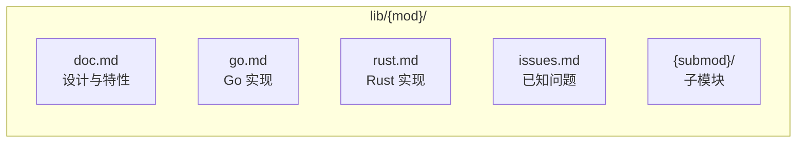
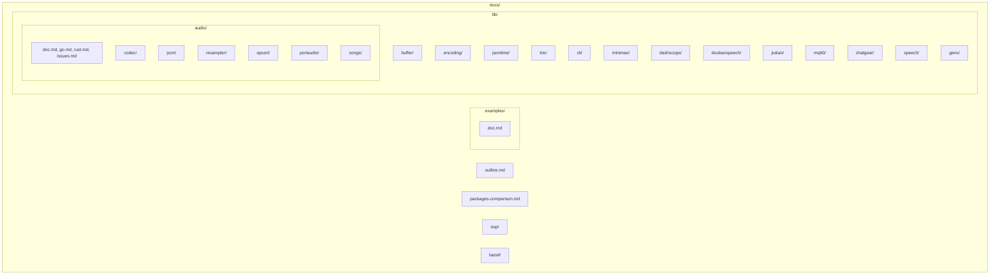
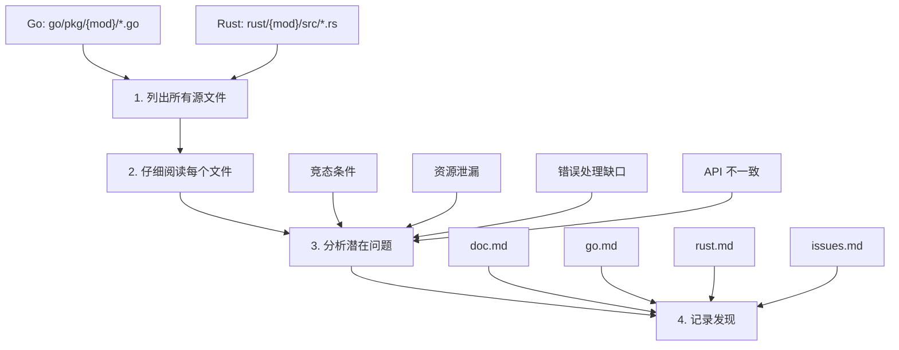

# GizToy 核心包文档

本目录包含所有 GizToy 核心包的设计文档、实现说明和已知问题。
库文档位于 `docs/lib/` 下。

## 文档结构

每个模块在 `docs/lib/` 下都有自己的目录，包含以下文件：

---

## 包列表

### 基础层

| 包 | 描述 | Go | Rust |
|---------|-------------|:--:|:----:|
| [buffer](./lib/buffer/doc.md) | 缓冲区工具 | ✅ | ✅ |
| [encoding](./lib/encoding/doc.md) | 编码工具（Base64、Hex） | ✅ | ✅ |
| [jsontime](./lib/jsontime/doc.md) | JSON 时间类型序列化 | ✅ | ✅ |
| [trie](./lib/trie/doc.md) | 前缀树数据结构 | ✅ | ✅ |
| [cli](./lib/cli/doc.md) | CLI 工具 | ✅ | ✅ |

### 音频处理层

| 包 | 描述 | Go | Rust |
|---------|-------------|:--:|:----:|
| [audio](./lib/audio/doc.md) | 音频处理框架 | ✅ | ✅ |
| [audio/codec](./lib/audio/codec/doc.md) | 编解码器（Opus、MP3、OGG） | ✅ | ✅ |
| [audio/pcm](./lib/audio/pcm/doc.md) | PCM 处理、混音器 | ✅ | ✅ |
| [audio/resampler](./lib/audio/resampler/doc.md) | 采样率转换（soxr） | ✅ | ✅ |
| [audio/opusrt](./lib/audio/opusrt/doc.md) | Opus 实时流 | ✅ | ⚠️ |
| [audio/portaudio](./lib/audio/portaudio/doc.md) | 音频 I/O（仅 Go） | ✅ | ❌ |
| [audio/songs](./lib/audio/songs/doc.md) | 内置声音生成 | ✅ | ✅ |

### API 客户端层

| 包 | 描述 | Go | Rust |
|---------|-------------|:--:|:----:|
| [minimax](./lib/minimax/doc.md) | MiniMax API 客户端 | ✅ | ✅ |
| [dashscope](./lib/dashscope/doc.md) | DashScope 实时 API | ✅ | ✅ |
| [doubaospeech](./lib/doubaospeech/doc.md) | 豆包语音 API 客户端 | ✅ | ⚠️ |
| [jiutian](./lib/jiutian/doc.md) | 九天 API（仅文档） | ❌ | ❌ |
| [openai-realtime](./lib/openai-realtime/doc.md) | OpenAI 实时 API | ✅ | ✅ |

### 通信层

| 包 | 描述 | Go | Rust |
|---------|-------------|:--:|:----:|
| [mqtt0](./lib/mqtt0/doc.md) | 轻量级 MQTT 客户端 | ✅ | ✅ |
| [chatgear](./lib/chatgear/doc.md) | 设备通信框架 | ✅ | ✅ |
| [chatgear/transport](./lib/chatgear/transport/doc.md) | 传输层抽象 | ✅ | ✅ |
| [chatgear/port](./lib/chatgear/port/doc.md) | 媒体端口 | ✅ | ✅ |

### AI 应用层

| 包 | 描述 | Go | Rust |
|---------|-------------|:--:|:----:|
| [speech](./lib/speech/doc.md) | 统一语音接口 | ✅ | ✅ |
| [genx](./lib/genx/doc.md) | LLM 通用接口框架 | ✅ | ⚠️ |
| [genx/agent](./lib/genx/agent/doc.md) | Agent 框架（仅 Go） | ✅ | ❌ |
| [genx/agentcfg](./lib/genx/agentcfg/doc.md) | Agent 配置系统（仅 Go） | ✅ | ❌ |
| [genx/match](./lib/genx/match/doc.md) | 模式匹配引擎（仅 Go） | ✅ | ❌ |

---

## 示例

- [examples](./examples/doc.md)：目录结构和如何运行示例

---

## 目录结构

---

## 其他文档

| 目录 | 用途 |
|----------|---------|
| `esp/` | ESP32 和 ESP-RS 说明和比较 |
| `bazel/` | Bazel 构建规则和集成说明 |
| `packages-comparison.md` | 跨语言包比较 |

---

## 实现进度概览

### 图例
- ✅ 完全实现
- ⚠️ 部分实现
- ❌ 未实现

### 功能比较

| 功能 | Go | Rust | 备注 |
|---------|:--:|:----:|-------|
| **基础** |
| 块缓冲区 | ✅ | ✅ | |
| 环形缓冲区 | ✅ | ✅ | |
| Base64 编码 | ✅ | ✅ | |
| Hex 编码 | ❌ | ✅ | Rust 额外实现 |
| JSON 时间类型 | ✅ | ✅ | |
| 前缀树 | ✅ | ✅ | |
| **音频** |
| Opus 编解码器 | ✅ | ✅ | |
| MP3 编解码器 | ✅ | ✅ | |
| OGG 容器 | ✅ | ✅ | |
| PCM 混音器 | ✅ | ✅ | |
| 采样率转换 | ✅ | ✅ | |
| Opus 实时流 | ✅ | ⚠️ | Rust 缺少 OGG 读写器 |
| 音频 I/O | ✅ | ❌ | 仅 Go（portaudio） |
| **API 客户端** |
| MiniMax 文本/语音/视频 | ✅ | ✅ | |
| DashScope 实时 | ✅ | ✅ | |
| 豆包语音 TTS/ASR | ✅ | ✅ | |
| 豆包语音 TTS v2 | ✅ | ❌ | |
| 豆包语音 ASR v2 | ✅ | ❌ | |
| OpenAI 实时 | ✅ | ✅ | |
| **通信** |
| MQTT 3.1.1 | ✅ | ✅ | |
| MQTT 5.0 | ⚠️ | ⚠️ | 部分支持，见 Issue #32 |
| ChatGear 传输层 | ✅ | ✅ | |
| ChatGear MediaPort | ✅ | ✅ | |
| **AI 应用** |
| 统一语音接口 | ✅ | ✅ | |
| LLM 上下文 | ✅ | ⚠️ | Rust 基本实现 |
| LLM 流式传输 | ✅ | ⚠️ | Rust 基本实现 |
| 工具调用 | ✅ | ⚠️ | Rust 基本实现 |
| Agent 框架 | ✅ | ❌ | |
| Agent 配置 | ✅ | ❌ | |
| 模式匹配 | ✅ | ❌ | |

---

## 优先级建议

### P0 - 关键缺失

1. **genx/agent**（Rust）：Agent 框架是核心功能
2. **audio/opusrt OGG 读写**（Rust）：实时音频流所需

### P1 - 功能对等

1. **doubaospeech v2**（Rust）：新 API 版本支持
2. **genx 流式/工具**（Rust）：完成基础功能

### P2 - 增强

1. **audio/portaudio**（Rust）：音频 I/O 支持
2. **mqtt0 MQTT 5.0**：完整协议支持

---

## 工作方法论

### 逐文件审查流程

对于每个模块，文档通过严格的逐文件审查流程生成：

### 问题分类

审查中发现的问题按严重程度分类：

| 严重程度 | 描述 | 示例 |
|----------|-------------|---------|
| 🔴 **严重** | 数据丢失、安全漏洞、崩溃 | 缓冲区溢出、SQL 注入 |
| 🟠 **主要** | 错误行为、资源泄漏 | 内存泄漏、竞态条件 |
| 🟡 **次要** | 边缘情况 bug、错误消息不清晰 | 边界错误、不清晰的 panic 消息 |
| 🔵 **增强** | 缺少功能、性能改进 | 缺少 API、不必要的分配 |
| ⚪ **备注** | 设计观察、技术债务 | 代码重复、命名不一致 |

---

## 相关资源

- 外部 API 文档：`lib/minimax/api/`、`lib/dashscope/api/`、`lib/doubaospeech/api/`
- 问题跟踪：`issues/`
- 示例代码：`examples/go/`、`examples/rust/`
